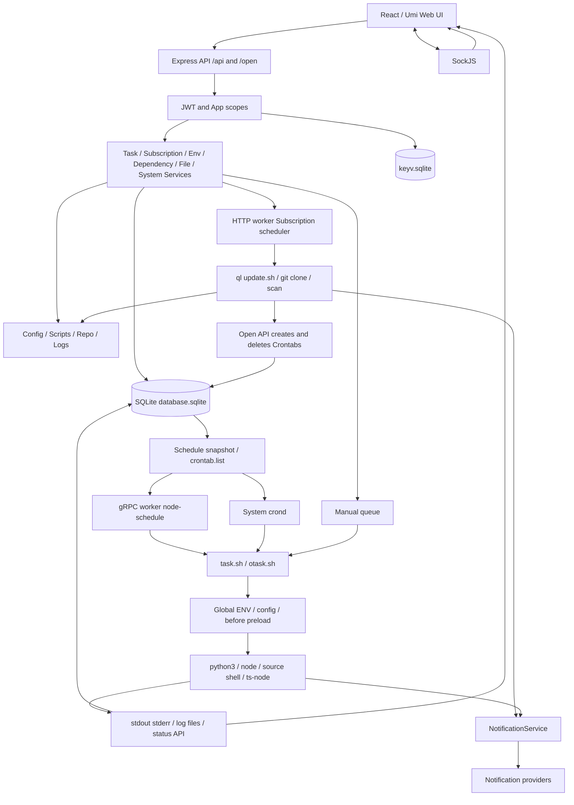
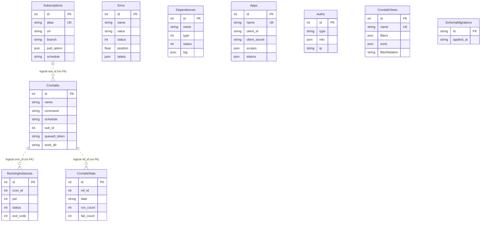

# PHASE0_REPORT

> Phase 0 历史快照：本文记录重构前基线。当前代码已新增 GitCredential / Repository、可空订阅引用及兼容适配器；现状增量、测试和限制见 [Phase 1 报告](PHASE1_REPORT.md)。旧执行管线保持基线行为。

## 1. Executive Summary

**Phase 0 文档与限定范围基线已建立；未进入 Phase 1。生产行为没有改变。**

审计提交：`4eb27427f809b565202f0b1bfa8129073f3fe5bd`；日期：2026-09-15。

当前青龙由 React/Umi UI、Express HTTP worker、gRPC调度worker、SQLite和Shell执行层组成。数据模型不仅有任务/订阅/ENV，也有运行实例、日统计、视图及Auths JSON系统状态。Git订阅每次删除clone目录后浅克隆，扫描后把文件复制到scripts，再通过Open API创建/删除任务。Task通常运行scripts副本。

最大耦合在 **DB → crontab.list → Shell文本扫描 → Open API → DB**，以及分散在服务、Shell、preload中的ENV、cwd、日志和退出状态处理。未来Worktree重构最大的风险是把可删除clone目录误当用户持久工作区，或把repo/alias/script/log身份混为一体。Runtime重构还会碰到全局依赖优先解析与不同语言ENV语义。

已确认高风险：repo本地修改被删除；JS ENV模板表达式被求值；凭证进入URL/command与潜在日志；alias与目录算法不一致；全局依赖和scripts更新缺少资源级锁。全部仅记录，无生产修复。

## 2. Current Architecture

技术栈、模块/API/UI映射、权限和Architecture Decision Log：[00 当前架构](docs/refactor/00-phase0-current-architecture.md)。

## 3. Data Model

图中关联均为逻辑关系，无ORM FK。主库database.sqlite，缓存keyv.sqlite。真实依赖表名 **Dependences**；没有独立User/Notification表，使用Auths.type/info。Cron全部字段、Subscription字段、CRUD来源、迁移路径见[01 数据模型](docs/refactor/01-current-data-model.md)。RunningInstances保存exit_code，Crontabs没有该字段。

## 4. Git / Subscription Flow

手工：pages/subscription.runSubscription → PUT /api/subscriptions/run → SubscriptionService.run/runSingle → formatCommand → ScheduleService.runTask。

自动：initTask → SubscriptionService.handleTask → node-schedule/toad-scheduler callback → 同一runTask。

共同路径：subscription queue → Bash `SUB_ID=id ql repo ...` → update.sh.main/get_uniq_path/update_repo → **rm -rf clone目录 + git clone -q --depth=1 [-b branch]** → gen_list_repo复制scripts → diff_cron → add_cron/del_cron → shell/api.sh → /open/crons → CronService.create/remove → DB与调度；callbacks写日志、运行sub_after并通知UI。

本地真实Git已验证modified/untracked/local commit/detached/conflict五种状态均丢失，branch独立clone。逐步骤输入/输出/副作用、目录算法和自动发现规则：[02 调用链](docs/refactor/02-current-git-subscription-flow.md)。

## 5. Task Execution Flow

手工：UI/API → CronService.run queued_token → runSingle认领 → makeCommand → spawn Bash。

定时：DB → schedulerMutation保护的crontab.list + gRPC注册 → system crond或node-schedule/runCron → makeCommand产物 → Bash。

随后 task.sh → import_config/define_program → otask.check_file/preload → enter_script_workdir → python3/node/source sh/ts-node → stdout/stderr → 文件日志 → status API → RunningInstances及stats。before/after已有实现，但没有四阶段成功/失败/可靠finally模型。外层task.sh exit0不能取代脚本退出码。[03 执行、调度、Hooks、Logging、Notification](docs/refactor/03-current-task-execution-flow.md)。

## 6. ENV Model

Envs仅Global、明文；EnvService生成env.sh/env.js/env.py。enabled同名按顺序用&拼接；disabled不生成，但宿主同名变量不因此被绝对隔离。JS/Python preload与Shell source路径不同，Backend不直接注入Envs。JS `${...}`被求值，Shell trim与JS/Python保留空格不同。Config是直接文件编辑，无Config Asset绑定/版本资源。[04 ENV/Config及消费者分类](docs/refactor/04-current-env-model.md)。

## 7. Dependency Model

Node：pnpm add/remove/ls -g，preload支持全局依赖优先。Python：pip3 install，PYTHON_HOME存在则--prefix，否则默认安装环境；python3由PATH确定。Linux：Alpine apk，Debian/Ubuntu apt-get，yum未实现。dep_cache包含安装环境本体，不全是下载缓存；无受管理pyenv/venv/per-repo Node runtime。[05 模型及语义命令表](docs/refactor/05-current-dependency-model.md)，[12 全部源码候选位置](docs/refactor/12-source-inventory.md)。

## 8. Filesystem Layout

QL_DIR下有源码/构建、.env、.tmp、shell/preload生成文件；QL_DATA_DIR（默认QL_DIR/data）下有db/repo/raw/scripts/config/log/syslog/deps/dep_cache/ssh.d/bak/upload；另写HOME/.ssh、HOME/bin、/tmp/env_PID.json。少数依赖安装和Config写入路径硬编码QL_DIR/data。

完整目录树、所有者、Source of Truth/Cache/Runtime State、可删除性与Docker/Native差异：[06 文件布局](docs/refactor/06-current-filesystem-layout.md)。

## 9. Key Risks

| Severity | 重点 |
|---|---|
| Critical | 更新删除clone；未来Worktree数据持久性迁移不可直接沿用 |
| High | JS ENV代码求值、明文凭证/command泄漏、Shell拼接边界、alias/目录冲突、配置数据根差异、无repo/runtime互斥、SSH host校验关闭 |
| Medium | 嵌套注释回退、ENV三文件不原子、退出码边界、临时环境文件、日志身份冲突、部署/Node26兼容、通知可变实例状态 |
| Low | 未确认独立Low问题；文档和候选清单需随后续代码更新 |

每项文件/函数、影响、重现和后续建议、已确认与待验证区别：[07 风险清单](docs/refactor/07-current-risks.md)。不是对全部输入均可未认证利用的断言。

## 10. Refactor Impact Map

Git Credential/Repository/Scoped ENV/Hooks/Runtime：High；Worktree与统一Execution Resolver：Critical；日志兼容适配：Medium。逐项Backend/DB/Frontend/Executor/Filesystem表：[08 影响范围](docs/refactor/08-refactor-impact-map.md)。另有[09 Repository-Worktree耦合分析](docs/refactor/09-repository-worktree-coupling.md)、[10 Legacy Compatibility Contract](docs/refactor/10-legacy-compatibility-contract.md)。本报告风险等级为源码评估，不是GitNexus工具输出。

## 11. Test Baseline

- 既有测试：Node22隔离运行 **176通过，0失败，3跳过**。跳过为macOS缺flock的3个跨进程锁测试。
- 新增测试：**17通过，0失败，0跳过**，三份文件；真实Git、三语言task.sh、ENV生成、调度child、SQLite模型与exit7。
- 宿主Node26首次失败包含缺配置/native binding及旧JWT依赖SlowBuffer不兼容；已用隔离配置/Node22定位，未升级依赖。
- 自动发现的API捕获、模型和status持久化分段验证；**不宣称UI→HTTP→clone→自动入库全栈端到端通过**。
- 系统crond、Linux flock、镜像/native矩阵、真实凭证和通知、全局依赖安装冲突仍待隔离运行验证。

复现命令、环境修正原因、已有/新增/未覆盖清单：[11 测试报告](docs/refactor/11-test-baseline.md)。

## 12. Recommended Phase 1 Entry Point

从 `back/data/subscription.ts` 的url/pull_option/alias映射、`back/config/subscription.ts:formatUrl/formatCommand`、`SubscriptionService`与`SshKeyService`的凭证边界开始，建立独立Credential与稳定Repository identity的兼容适配。API沿api/subscription/index扩展，UI从subscription/modal的凭证输入开始，文件系统先明确legacy uniq_path映射/冲突检测及备份。保持旧CLI、字段和scripts副本语义，**不要在Phase1起步就切换bare/worktree或执行器**。详细gate见08。

## 完成清单与限制

- [x] 模块图、全核心数据模型与ER图
- [x] Subscription/Git调用链与破坏性更新验证
- [x] Task Runner/调度/上下文/日志/通知/Hooks审计
- [x] ENV、Dependency、Runtime命令位置清单
- [x] Filesystem、部署假设、Repository/Worktree耦合
- [x] Concurrency与Security风险记录
- [x] Fixtures与自动基线测试、已有套件运行
- [x] Legacy Compatibility Contract、Refactor Impact Map
- [x] 总报告与Phase1建议（未实施）

GitNexus MCP未暴露，仓库声明的本地skill/runner缺失；未完成其query/context/impact图验证。没有修改既有生产符号、没有commit，因此没有声称执行detect_changes。后续生产编辑前仍须恢复工具并遵守AGENTS约束。Linux系统级与全栈验证缺口已在各文档明确标注UNKNOWN / NEED RUNTIME VERIFICATION。

## Git Diff Summary / 修改范围

全部为新增：`PHASE0_REPORT.md`、`docs/refactor/00..13`、`tests/phase0/`三份测试、`fixtures/test-repo/`、`diagnostics/phase0/`。现有生产文件与package.json/pnpm-lock.yaml无差异；没有schema/API/任务/订阅/ENV/依赖/UI行为变化。原有未跟踪refactor/未改动。未自动commit。

新增文件清单见[交付清单](docs/refactor/13-delivery-manifest.md)。由于新增文件未stage，普通git diff --stat不显示这些文件；应结合git status --short与清单审阅。
