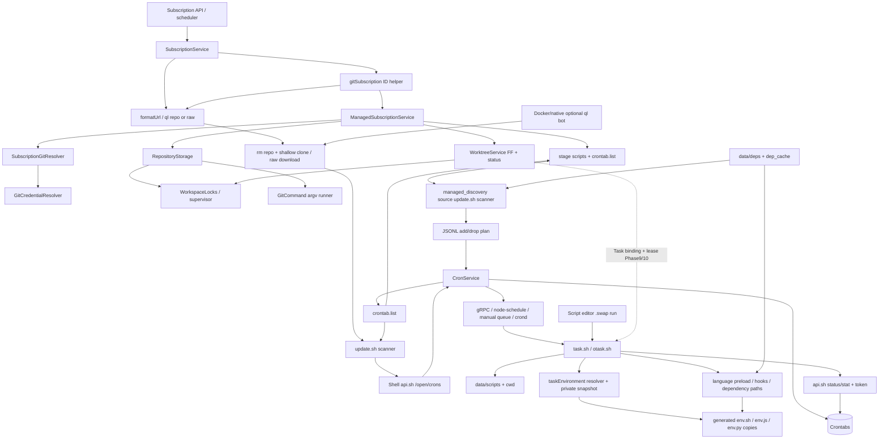

# 当前运行依赖图 / 删除影响

实线为当前已确认调用或数据消费；虚线为未来替代。不是目标图伪装现状。

| 删除 A | 直接破坏 B/C/D | 当前证据 |
| --- | --- | --- |
| update.sh whole | Managed scanner、ql ops、Legacy source | managed_discovery.sh:25–26；initTask/SystemService/CLI |
| subscriptionGit whole | Managed credential/ref prepare、stage prefix、convert | managedSubscription.ts:6/36/223 |
| crontab.list | scanner存在性、无ID Task反查、system cron投影 | cron.setCrontab；Managed.stage；task.handle_log_path |
| data/scripts copy | Task cwd/entrypoint、Script API编辑运行、notification/deps | otask.enter_script_workdir；api/script.ts:319；gen_list_repo |
| env generated files | transport.prepare直接read、global-only语言import | executionEnvironmentTransport.ts；sitecustomize.* |
| preloads whole | hooks、SDK、global module lookup、signal | sitecustomize.* run与顶部加载 |
| /open rewrite / system token | Task真实状态/统计/CLI通知/管理员恢复 | api.sh update_cron/record_cron_stat/notify/update_auth |
| deps/dep_cache | 当前可见包与共享辅助文件 | getInstallCommand、node_path_cache、scanner |
| migration chain before fresh bootstrap | 新Git/Worktree/Scoped表不再被创建 | loaders/db仅sync九旧模型；migrateSchema创建新表 |

锁是资源控制边界，不是线程级装饰。Task目前没有Worktree lease，未来接入需绑定子进程生存期。平台构建Git clone与上图业务获取分开。
