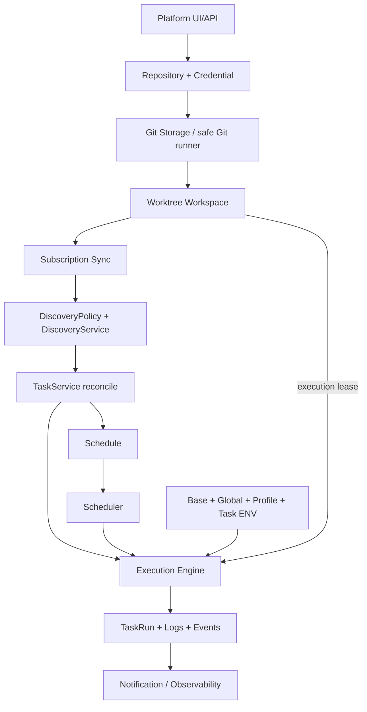

# Git-native Script Automation / Scheduling Platform

**当前设计方向：greenfield-only。** 仅 Fresh Install / Database / Configuration / Repository / Task Setup；不支持 QingLong 数据、API、目录、ENV、CLI 或依赖兼容。Phase 0–4 是 Historical Refactor Records，不再是新设计的兼容契约。

本文描述目标与实施边界，不代表目标全部已经实现。已实现核心：Credential、Repository、persistent Git、Worktree、锁/lease、Managed sync、Scoped ENV。Task/Scheduler/Runner/Discovery/Dependency 仍有桥；4.5A 不修改生产行为。

DB 是领域定义来源，Git 是对象/refs/工作区内容来源；日志是运行观测，不反写 Task 定义。source身份不用路径字符串猜测。运行环境不污染 Backend/Git/installer。fresh-only 并不取消安全验证、失败恢复、身份认证或新平台版本升级。

当前→目标间的 [桥登记](../../TEMPORARY_BRIDGES.md)、[清理计划](../../GREENFIELD_REMOVAL_PLAN.md) 是实施约束。下一步4.5B仅清理与有限整合；不开始Phase5。
