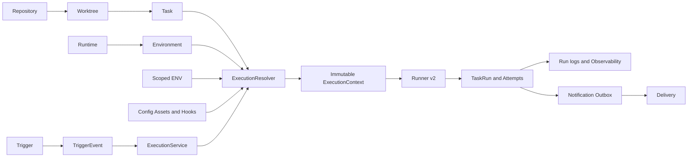

# Platform 1.0 architecture

Current source architecture: Phase 15, schema v9. Local convergence and GitHub-hosted
qualification are separate gates; the current result is recorded in [Phase 15](../../PHASE15_REPORT.md).
Historical Phase 0–14 reports describe earlier implementations, not compatibility requirements.

Repository synchronization and Code Workspace operate directly on canonical Worktrees.
Discovery reconciles stable Task definitions. It does not stage scripts or publish system crontabs.
Backup coordinates these mutations through a platform barrier, snapshots SQLite and domain resources,
and restores through a durable offline journal.

Python/Node toolchains and dependency Builds are explicit resources. Execution pins a validated Build
and uses an absolute executable with literal argv and a frozen environment. No host-language fallback,
global dependency directory, automatic SDK loader or generated language ENV participates.

See [ownership](01-domain-model.md), [filesystem](05-filesystem-layout.md),
[service boundaries](07-service-boundaries.md), [bridge disposition](08-temporary-bridges.md),
and [startup/operations](20-platform-operations.md). Detailed contracts remain in architecture documents 09–19.
