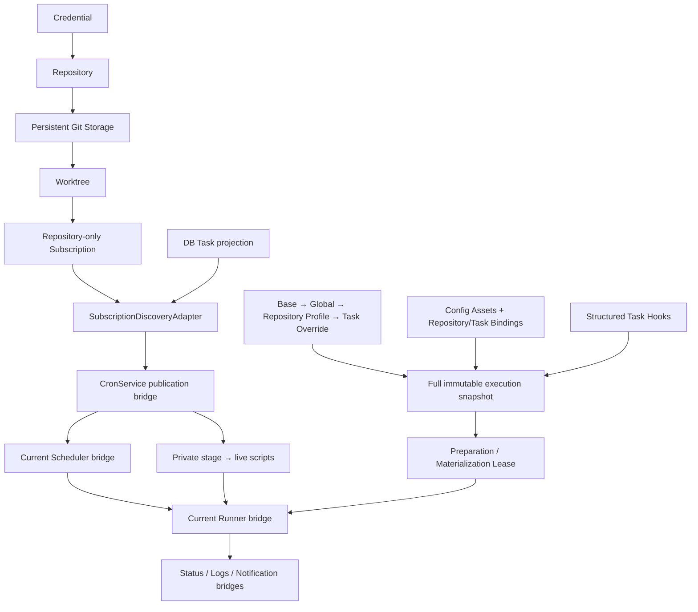

# Git-native Script Automation / Scheduling Platform

**Phase 5：Config Assets / Hooks v2，Operational Schema v2。** 支持 Fresh 安装与已验证的新平台 v1→v2；不支持 QingLong 数据、旧 API、ENV、CLI 或目录迁移。Phase 0–4 与 4.5A 为历史记录/实施依据，当前行为以源码及 [Phase 5 报告](../../PHASE5_REPORT.md) 为准。

## 当前已实现架构

DB 是领域定义来源，Git 保存对象、refs 与工作区内容。Subscription ID 与 relative-path discovery key 决定发布身份；展示名、URL 拼写不参与。Git locks/lease、dirty/local commit 保护及发布补偿继续有效。任务子环境不继承 Backend secrets，不修改父进程环境。

## 后续边界

Task/Schedule/TaskRun 拆分、Runtime、Runner v2、完整 Discovery v2 仍是后续阶段，未创建占位页面或空表。B05 已删除，B07/B03 已缩减；其余当前职责见 [桥登记](../../TEMPORARY_BRIDGES.md)。Linux 实机验收待执行已配置的 CI；本机浏览器、Fresh 全链路及重启验收通过。

Config Assets 与四阶段 Hook 已落地，见[配置与生命周期架构](09-config-assets-and-hooks.md)。B06 的 Hook 部分已移除，B11 缩为平台内部 Settings，B17 接入当前 source workspace。
