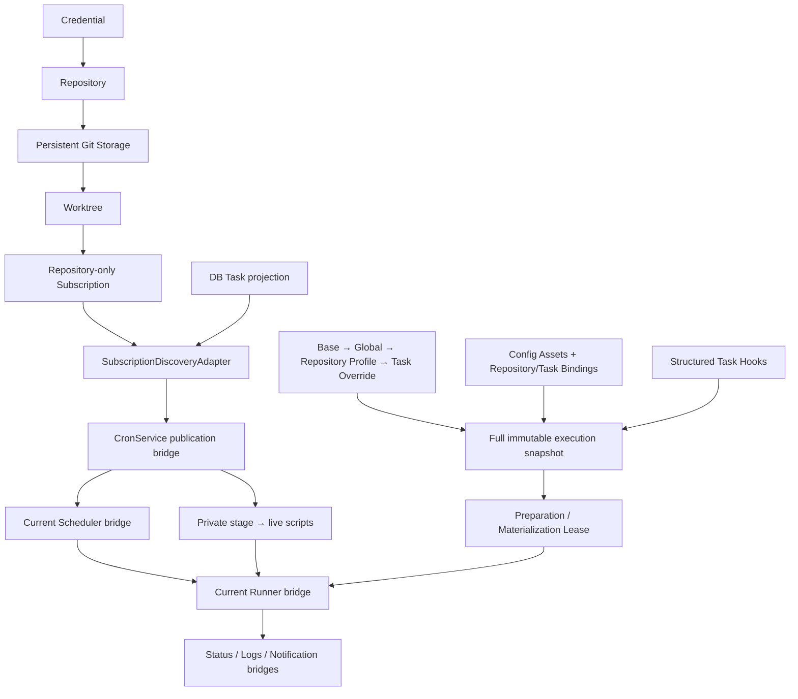

# Git-native Script Automation / Scheduling Platform

> **当前基线：Phase14 + Phase12 / schema v9。** Code Workspace 直接消费 Worktree，与 Execution/GitSync 复用 EX lease，与 Backup 复用平台 mutation barrier。当前结构见 [Code Workspace](19-code-workspace.md) 与 [Backup/Restore](18-backup-restore.md)；下列早期阶段段落为历史记录。后续顺序 Phase16A → Phase15 → Phase16B。

> **当前基线：Phase 13 / schema v9。** TaskRun观测、健康状态、Channel/Policy/Outbox/Delivery已生效。下方早期段落保留为历史记录；当前见 [Run Observability](16-task-run-observability.md)、[Notification Platform](17-notification-platform.md) 与 [Phase13报告](../../PHASE13_REPORT.md)。下一阶段固定为Phase14 Backup/Restore，Phase12暂缓。

> **当前基线：Phase 11 / schema v8。** Task 无 schedule 字段；TaskTriggers、TriggerEvents 与 DiscoveryPolicies 已生效。正常触发链为 Trigger → ExecutionService.submit → Phase 10 Runner。下文早期阶段内容为历史演进记录，以 [Discovery / Trigger 架构](15-discovery-triggers.md) 和 [Phase 11 报告](../../PHASE11_REPORT.md) 为当前约束。

> Phase 10 当前执行架构：Schema v7、TaskRuns / TaskRunAttempts、Worktree direct execution、immutable Context 与 Runner v2 已生效。下面保留的旧阶段描述不再定义正常执行路径。参见 [Execution Engine](14-execution-engine.md) 与 [当前桥接状态](../../TEMPORARY_BRIDGES.md#phase-10--execution-engine)。

> Phase 9 当前架构：Tasks 是定义事实来源；参见 [Task Domain](13-task-domain.md)。下文与此冲突的 Crontab 定义描述属于此前阶段，调度/结果桥仍按 TEMPORARY_BRIDGES 登记。

> **当前基线：Phase 8，schema v5。** Runtime Core 同时支持 Python 与 Node；Node 新增 exact PackageManagerToolchain、NodeEnvironment、不可变 Revision/Build，独立 node_modules 与共享 store。下文早期阶段描述保留为演进记录；当前结构见 [Node Runtime 架构](12-node-runtime-environments.md)，最新约束以该文档和 [Phase 8 schema](../refactor/phase8/10-schema-evolution.md) 为准。Task/Hook 仍使用现有 Runner Bridge，未实现 Phase 9/10 绑定。

**Phase 6：Python Runtime Manager，Operational Schema v3。** 支持 Fresh 安装与已验证的新平台 v1→v2→v3；不支持 QingLong 数据、旧 API、ENV、CLI 或目录迁移。Phase 0–4 与 4.5A 为历史记录/实施依据，当前行为以源码及 [Phase 6 报告](../../PHASE6_REPORT.md) 为准。

## 当前已实现架构

DB 是领域定义来源，Git 保存对象、refs 与工作区内容。Subscription ID 与 relative-path discovery key 决定发布身份；展示名、URL 拼写不参与。Git locks/lease、dirty/local commit 保护及发布补偿继续有效。任务子环境不继承 Backend secrets，不修改父进程环境。

## 后续边界

Task/Schedule/TaskRun 拆分、Python Environment、Node Runtime、Runner v2、完整 Discovery v2 仍是后续阶段，未创建占位页面或空表。B05 已删除，B07/B03 已缩减；其余当前职责见 [桥登记](../../TEMPORARY_BRIDGES.md)。Linux 实机验收待执行已配置的 CI；本机浏览器、Fresh 全链路及重启验收通过。

Config Assets 与四阶段 Hook 已落地，见[配置与生命周期架构](09-config-assets-and-hooks.md)。B06 的 Hook 部分已移除，B11 缩为平台内部 Settings，B17 接入当前 source workspace。

Python Runtime 是已实现的平台资源，见[Runtime 架构](10-python-runtime.md)。它独立于 Task 当前执行、Config snapshot、Hook lifecycle 和 B17。Phase 7 才开始 venv/依赖环境。

## Phase 7 current Runtime layer

Managed CPython → Python Environment → immutable Desired Revision → immutable venv Build / Resolved snapshot。Schema v4，RuntimeOperation 统一日志/取消/恢复；Current pointer 原子发布。Task Binding 留待 Phase 9。详见 [Python Environments](11-python-environments.md)。
