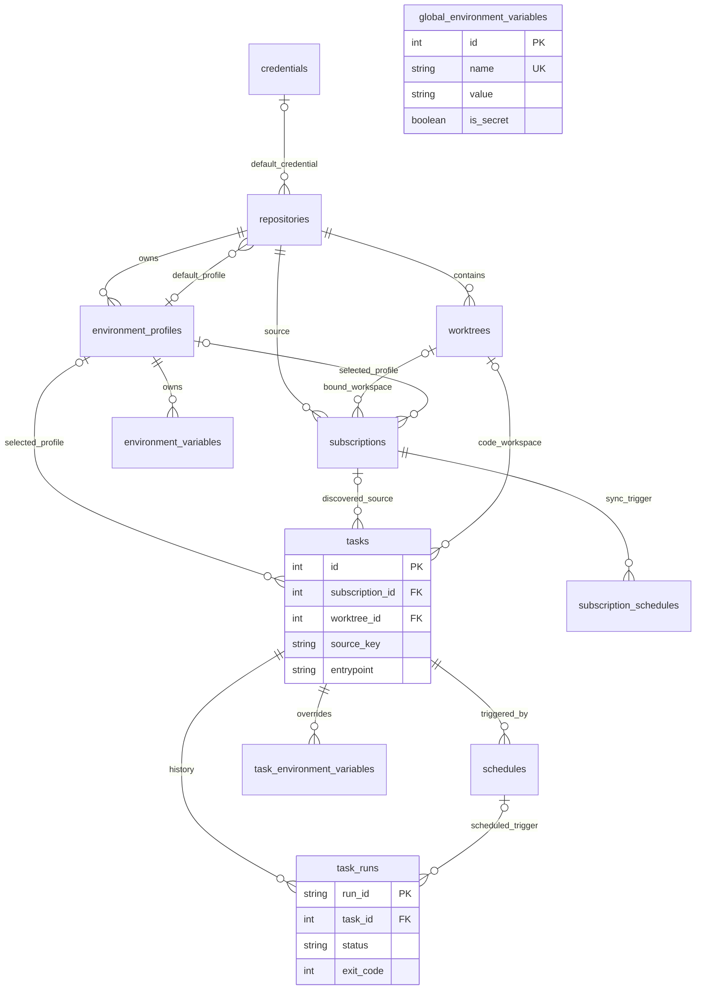

# Operational Schema v3 / 最终 Domain Schema

> **当前基线：Phase 8，schema v5。** Runtime Core 同时支持 Python 与 Node；Node 新增 exact PackageManagerToolchain、NodeEnvironment、不可变 Revision/Build，独立 node_modules 与共享 store。下文早期阶段描述保留为演进记录；当前结构见 [Node Runtime 架构](12-node-runtime-environments.md)，最新约束以该文档和 [Phase 8 schema](../refactor/phase8/10-schema-evolution.md) 为准。Task/Hook 仍使用现有 Runner Bridge，未实现 Phase 9/10 绑定。

**当前为 Operational v3；v1/v2 冻结内容用于签名验证迁移。下图含后续 Domain 目标。** 4.5B 使用 platform_schema_version=1，空库直接创建最终当前模型，非空未知签名拒绝启动；不支持 QingLong 升级导入。保留当前执行必需的桥表，Task/Schedule/TaskRun最终拆分在9/10。此图是最终目标，不是4.5B必须一次实现的schema。

## FK 策略（新平台）

| Child → Parent | 建议 | 原因 |
| --- | --- | --- |
| repositories.default_credential_id → credentials | nullable + RESTRICT | 匿名合法；删除不能偷换身份 |
| worktrees.repository_id → repositories | NOT NULL + RESTRICT | 代码/本地提交/租约必须显式释放 |
| environment_profiles.repository_id → repositories | NOT NULL + RESTRICT | 先解绑/删Profile，避免静默丢凭据 |
| subscriptions.repository_id → repositories | NOT NULL + RESTRICT | source必要，禁止URL fallback |
| subscriptions.worktree_id → worktrees | nullable until prepared + RESTRICT | NULL可表示尚未初始化，非legacy理由 |
| tasks.subscription_id → subscriptions | nullable + RESTRICT | 手工Task合法；需显式detach/retire，不能一删订阅丢Task |
| tasks.worktree_id → worktrees | nullable按source_kind + RESTRICT | source归属与执行lease；Git任务必填，手工command可空 |
| repositories.default_env_profile_id / subscriptions/tasks.env_profile_id → profiles | nullable + RESTRICT | NULL表示继承；cross-repo一致性还需服务校验或复合FK |
| profile vars → profiles | NOT NULL + CASCADE | 变量是聚合内子资源 |
| task vars → tasks | NOT NULL + CASCADE | 同上；执行已有不可变snapshot |
| schedules → tasks | NOT NULL + CASCADE（停调度后） | schedule定义属于Task，DB级联不能取消已注册job |
| task_runs → tasks | NOT NULL + RESTRICT，Task软删 | 保留审计历史，禁止级联擦除运行记录 |
| task_runs.schedule_id → schedules | nullable + SET NULL | 手工触发合法；Run存触发snapshot，删schedule保留历史 |
| stats → task/run identity | FK/聚合read model，按留存清理 | 不通过删Task静默删失败历史 |

当前sub_id/RunningInstances.cron_id/CrontabStats.ref_id仍逻辑FK；Phase4仅env_profile_id有真正FK。4.5B若加sub_id FK，先保证默认删除由明确detach/RESTRICT处理，不把fresh-only误解为CASCADE一切。

Global可单独global_environment_variables，Profile环境表避免nullable复合unique的SQLite NULL漏洞；Task/Profile名称分别unique(owner_id,name)。cross-resource同repo校验不能只靠三个独立FK解决。运行中的任务删除采用软删/显式stop与lease协调，SQL transaction不能代替进程控制。

Auth/settings/API clients保持安全引导，未来独立admin_users/platform_settings/notification_config/audit，不为画图好看删掉。Runtime/Config Assets留未来外键，不在本阶段创建空表。

## 已冻结的 Operational v1

15 个当前 ORM 模型 + PlatformMetadata 直接建库。Subscriptions.repository_id NOT NULL FK；worktree_id nullable FK；删除全部 URL/mode/pull/credential override 字段。Envs.name UNIQUE、TEXT value、SET/UNSET、is_secret，仍保留 SDK metadata/status 表示；不存在重复聚合。Crontabs 新增 source_relative_path/discovery_key/discovery_definition 及 unique(sub_id, discovery_key)，执行状态/日志桥表保留。

模型签名 + 实际 SQLite schema 签名 + foreign_key_check 决定重启是否接受；未知/中间检查点库不迁移、不清空。Fresh v1 Schema Frozen for next development phase。未来修改使用新平台自己的显式 schema evolution，不覆盖当前 v1。

## Phase 5 Operational v2

Fresh 与已验证 v1 通过显式事务迁移得到相同 v2 签名。新增 ConfigAssets、ConfigAssetRevisions、RepositoryConfigBindings、TaskConfigBindings、TaskHooks，移除旧 Task/Subscription Hook 字段。冻结 v1 记录保持不变。见 [Schema v2](../refactor/phase5/09-schema-v2.md)。

## Phase 6 Operational v3

新增 RuntimeProviders、RuntimeInstallations、RuntimeOperations。Fresh、有效 v2→v3 与有效 v1→v2→v3 最终签名相同；Runtime SQL 使用实际 CHECK/FK/唯一约束。冻结 v2 来源 platform-phase5，不能覆盖。详见 [Schema v3](../refactor/phase6/09-schema-v3.md)。

## Phase 7 current schema: v4

冻结 Phase 6 actual v3 后演化到 v4，旧 v1/v2 签名不变。新增 PythonEnvironments/Revisions/Builds，RuntimeOperations 扩展 enum。复合 FK 保证 Current 与 Build/Revision 属于同环境；runtime RESTRICT 与不可变触发器补充服务校验。valid v1→v2→v3→v4 与 fresh 同最终签名。详见 [schema evolution](../refactor/phase7/09-schema-evolution.md)。
