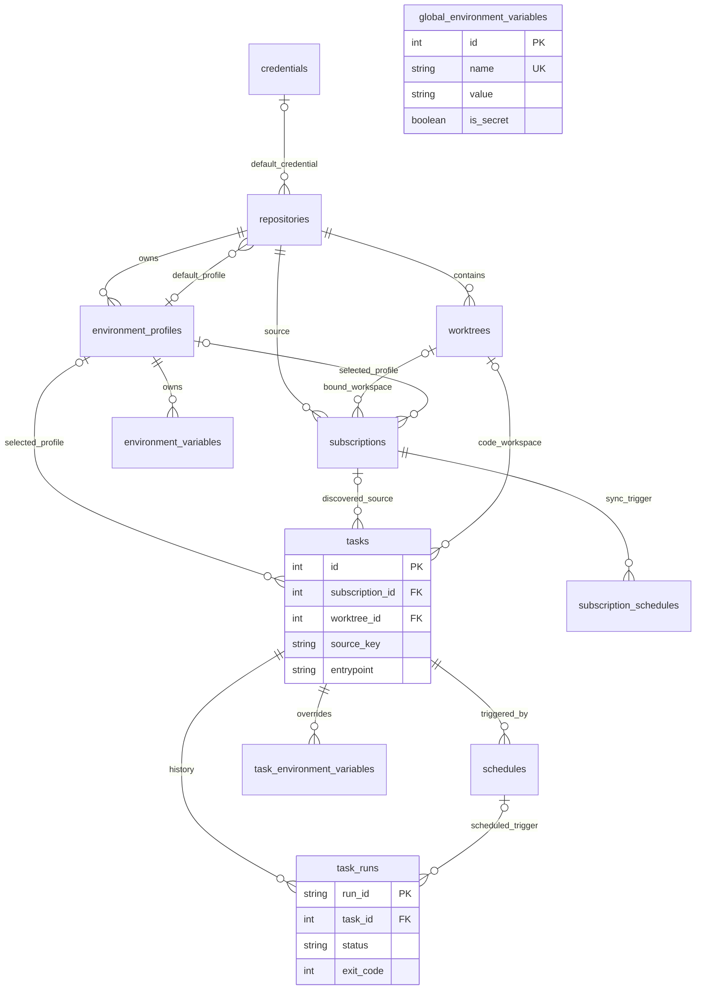

# Fresh Schema Baseline v1 / 最终 Domain Schema

**提案，不执行DDL。** 4.5B用platform_schema_version=1表示新的fresh operational baseline；新库拒绝QingLong升级导入。保留当前执行必需的桥表，Task/Schedule/TaskRun最终拆分在9/10。此图是最终目标，不是4.5B必须一次实现的schema。

## FK 策略（新平台）

| Child → Parent | 建议 | 原因 |
| --- | --- | --- |
| repositories.default_credential_id → credentials | nullable + RESTRICT | 匿名合法；删除不能偷换身份 |
| worktrees.repository_id → repositories | NOT NULL + RESTRICT | 代码/本地提交/租约必须显式释放 |
| environment_profiles.repository_id → repositories | NOT NULL + RESTRICT | 先解绑/删Profile，避免静默丢凭据 |
| subscriptions.repository_id → repositories | NOT NULL + RESTRICT | source必要，禁止URL fallback |
| subscriptions.worktree_id → worktrees | nullable until prepared + RESTRICT | NULL可表示尚未初始化，非legacy理由 |
| tasks.subscription_id → subscriptions | nullable + RESTRICT | 手工Task合法；需显式detach/retire，不能一删订阅丢Task |
| tasks.worktree_id → worktrees | nullable按source_kind + RESTRICT | source归属与执行lease；Git任务必填，手工command可空 |
| repositories.default_env_profile_id / subscriptions/tasks.env_profile_id → profiles | nullable + RESTRICT | NULL表示继承；cross-repo一致性还需服务校验或复合FK |
| profile vars → profiles | NOT NULL + CASCADE | 变量是聚合内子资源 |
| task vars → tasks | NOT NULL + CASCADE | 同上；执行已有不可变snapshot |
| schedules → tasks | NOT NULL + CASCADE（停调度后） | schedule定义属于Task，DB级联不能取消已注册job |
| task_runs → tasks | NOT NULL + RESTRICT，Task软删 | 保留审计历史，禁止级联擦除运行记录 |
| task_runs.schedule_id → schedules | nullable + SET NULL | 手工触发合法；Run存触发snapshot，删schedule保留历史 |
| stats → task/run identity | FK/聚合read model，按留存清理 | 不通过删Task静默删失败历史 |

当前sub_id/RunningInstances.cron_id/CrontabStats.ref_id仍逻辑FK；Phase4仅env_profile_id有真正FK。4.5B若加sub_id FK，先保证默认删除由明确detach/RESTRICT处理，不把fresh-only误解为CASCADE一切。

Global可单独global_environment_variables，Profile环境表避免nullable复合unique的SQLite NULL漏洞；Task/Profile名称分别unique(owner_id,name)。cross-resource同repo校验不能只靠三个独立FK解决。运行中的任务删除采用软删/显式stop与lease协调，SQL transaction不能代替进程控制。

Auth/settings/API clients保持安全引导，未来独立admin_users/platform_settings/notification_config/audit，不为画图好看删掉。Runtime/Config Assets留未来外键，不在本阶段创建空表。
