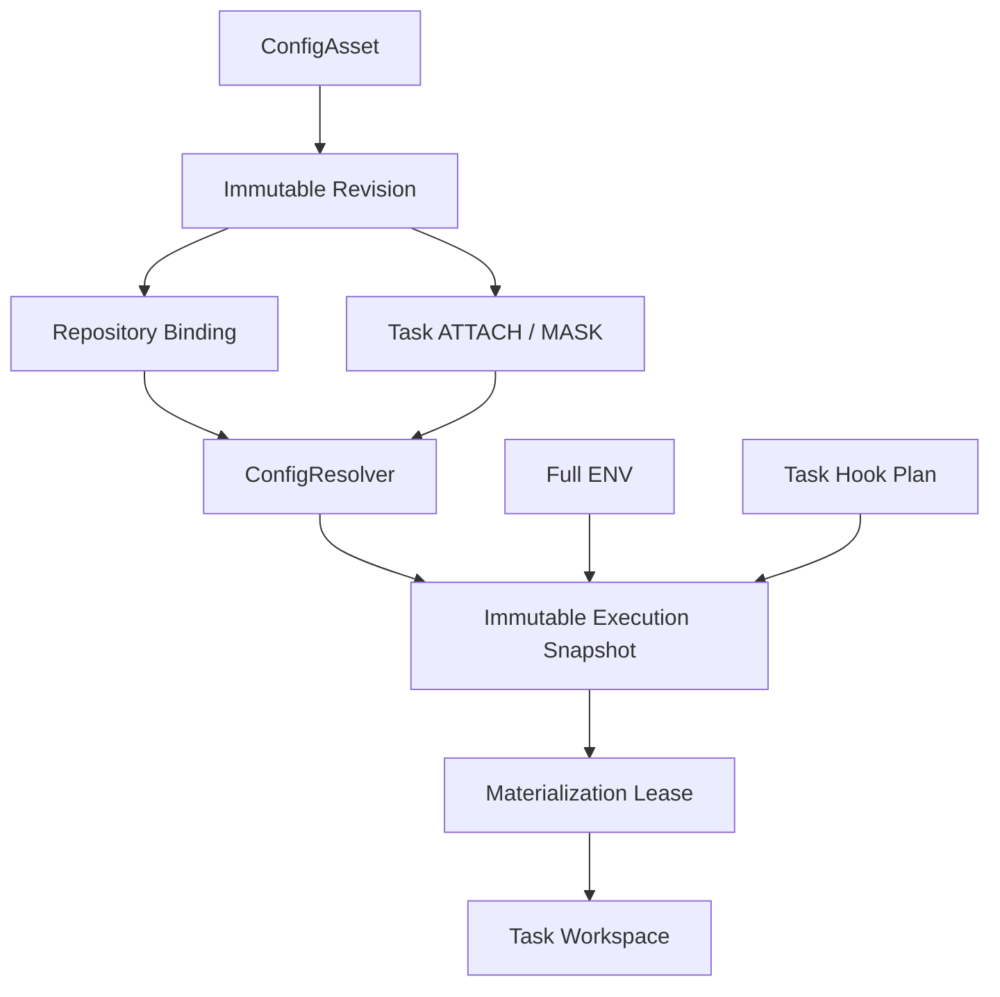
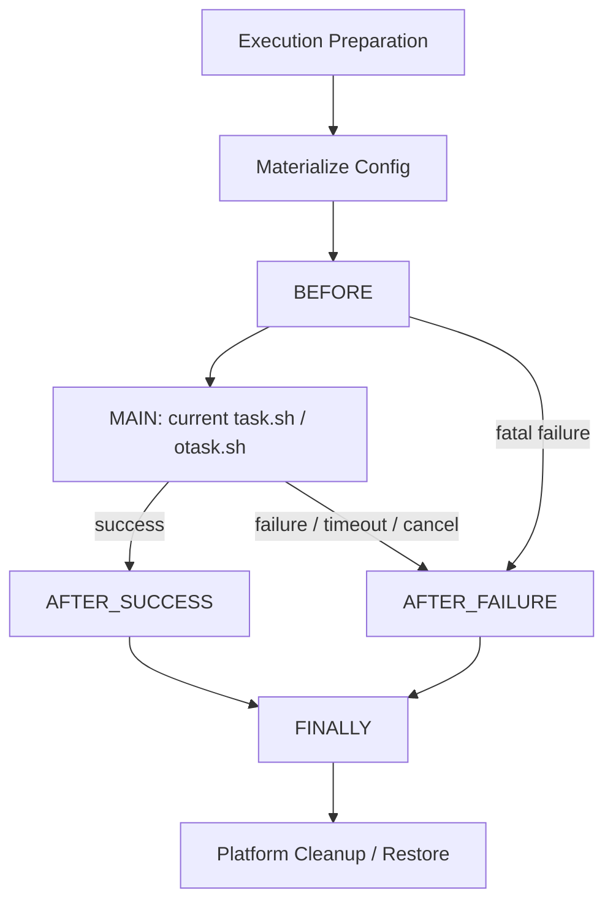

# Config Assets 与 Hooks v2（Phase 5）

> Phase15 convergence: schema v9 remains unchanged. The current cross-domain ownership, physical bridge removals and operations contract are in [Platform overview](00-platform-overview.md) and [Platform operations](20-platform-operations.md). Earlier bridge-retention statements below are historical. Hosted Linux qualification is a separate gate in [Phase15](../../PHASE15_REPORT.md).

SQLite 一次读事务固定 ENV、绑定/revision 和 Hook 计划。TaskWorkspaceResolver 是 B17：唯一了解 scripts publication 命名与 entrypoint/cwd 的新映射层；Config Domain 不依赖 Git 或 scripts 目录内部布局。跨进程租约覆盖完整生命周期，journal 在下次独占 acquire 恢复。

TaskExecutionPreparation、HookExecutor、Materialization 是 Phase 5 执行准备能力；MAIN 继续使用现有 Runner bridge，未建立 TaskRun Domain、Runtime Manager、Runner v2 或 Worktree direct execution。

完整协议与安全边界见 [Phase 5 文档](../refactor/phase5/01-config-asset-domain.md) 与 [报告](../../PHASE5_REPORT.md)。
