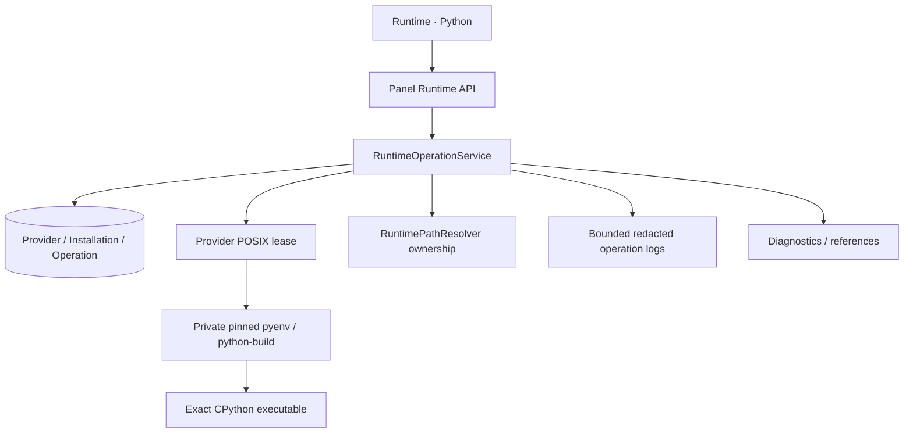
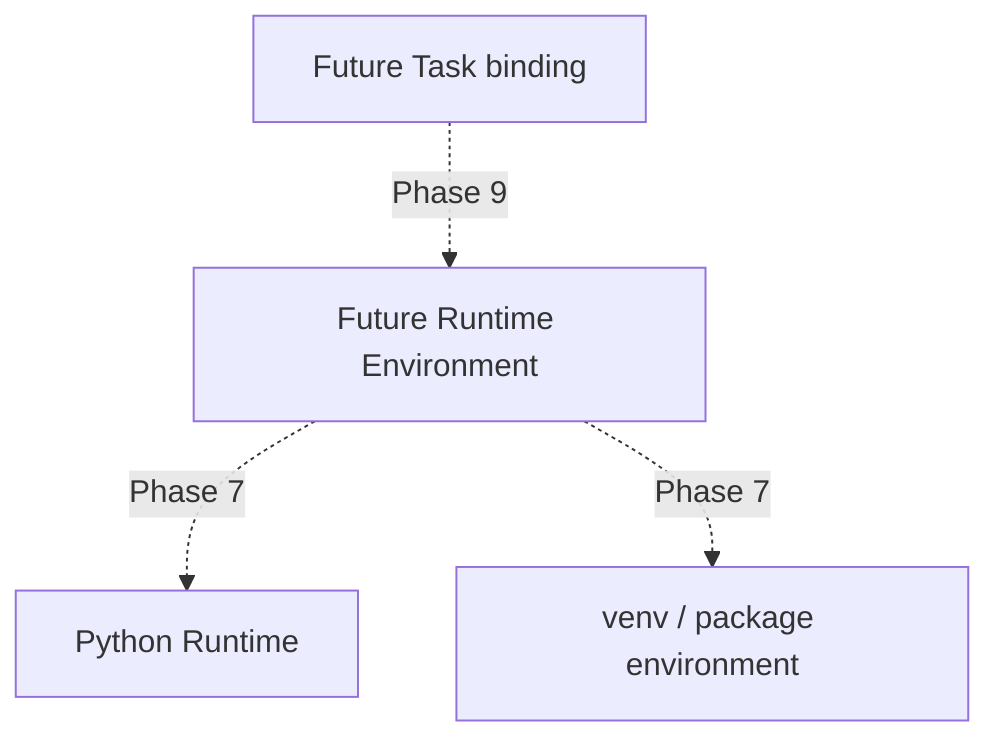

# Python Runtime Manager — Phase 6

实际前端 `/runtime-python`，API `/api/runtime/python/*`。Provider setup、catalog refresh、install/verify/remove/repair、operation logs/cancel、diagnostics 均为真实管理入口。页面由显式用户操作触发下载/编译，列表只读缓存和轻量 filesystem health。

第二张图是未来关系：当前 Task → Runner bridge 保持原行为，未绑定 R/E。Runtime 不是包环境，不包含 shared requirements/pyproject 管理。

详细契约：[Domain](../refactor/phase6/01-runtime-domain.md)、[Operations](../refactor/phase6/04-runtime-operations.md)、[Lock/Recovery](../refactor/phase6/05-locking-and-recovery.md)、[Security](../refactor/phase6/07-runtime-security.md)。
