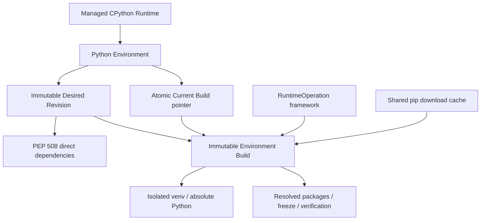
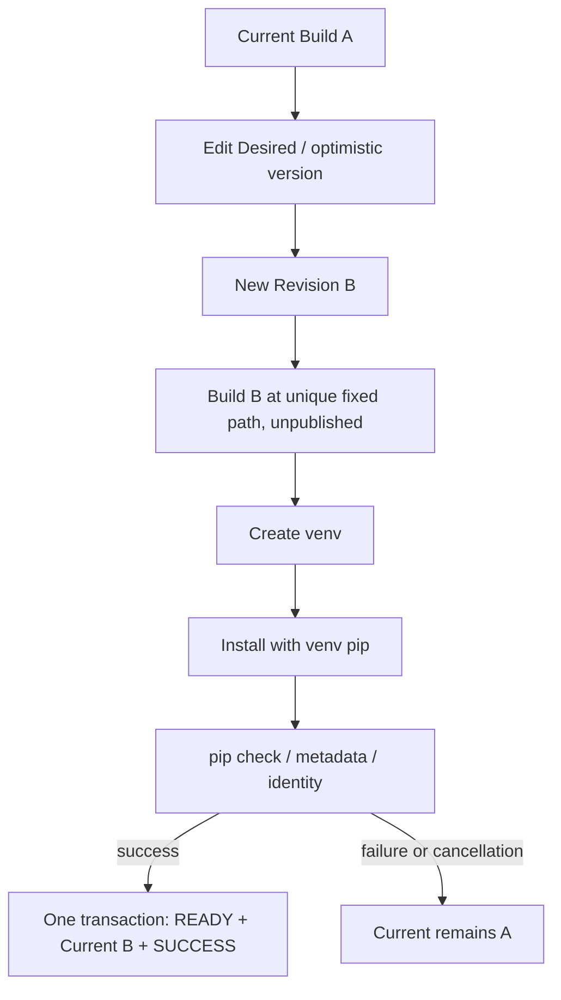
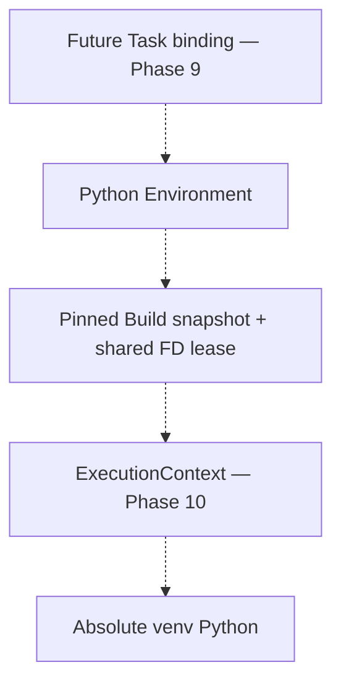

# Python Environments — current architecture (Phase 7)

> Phase15 convergence: schema v9 remains unchanged. The current cross-domain ownership, physical bridge removals and operations contract are in [Platform overview](00-platform-overview.md) and [Platform operations](20-platform-operations.md). Earlier bridge-retention statements below are historical. Hosted Linux qualification is a separate gate in [Phase15](../../PHASE15_REPORT.md).

虚线是未来契约，当前 Task/Hook 执行没有接入。本阶段 Source/ENV/Config/Hook/Workspace 架构保持现行 release baseline。

## Resource and filesystem contracts

Schema v4：Environment、不可变 Revision、不可变 Build；RuntimeOperation 增加环境类型。RuntimeReferenceService 聚合三类真实引用，RESTRICT 不自动级联删除解释器。

`runtime/python/environments/env-ID/builds/build-ID/venv` 是独立物化；旁路 metadata 保存 ownership/dev/ino。构建不移动 venv，READY 前只能经内部操作访问。Current pointer 发布是 DB 事务，不是可变目录。`cache/python/pip` 仅缓存 artifact，不共享安装。

锁序 Provider EX → Environment EX → Build SH/EX；首版串行。取消/崩溃复用 RuntimeOperation/POSIX supervisor。Resolver 返回 immutable snapshot + Build lease；旧 Build 不随 Current 修改。

Shared Package Layer、cache clear/GC、artifact-hash lockfile、private registry credentials、跨主机 venv 复制均未实现。B09/B10 仍服务现行 Python Task bridge；Phase 9/10 完成替代后退出。
