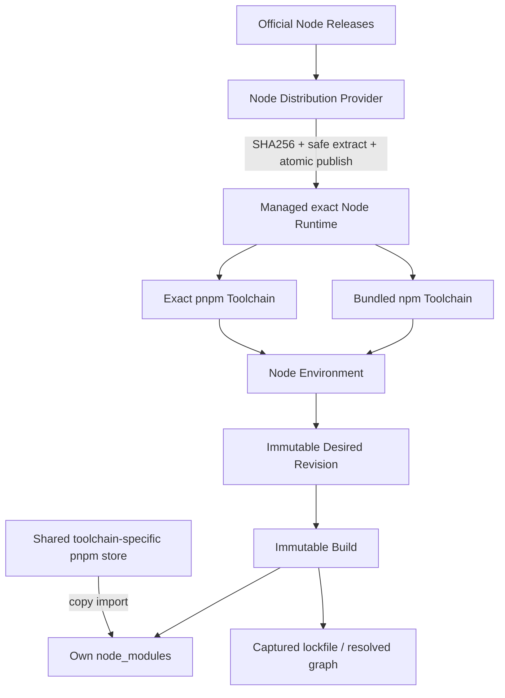
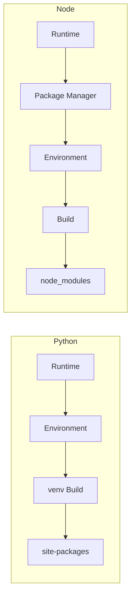
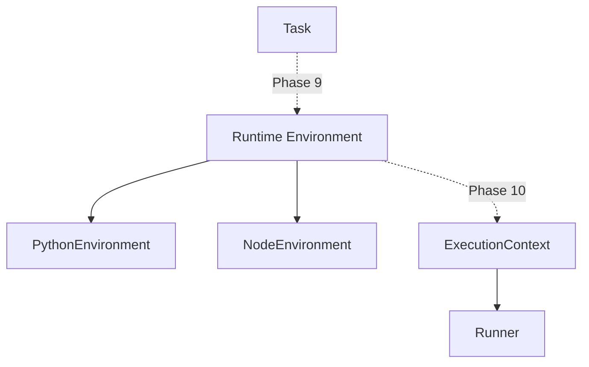

# Node Runtime + Dependency Environment（Phase 8）

> Phase15 convergence: schema v9 remains unchanged. The current cross-domain ownership, physical bridge removals and operations contract are in [Platform overview](00-platform-overview.md) and [Platform operations](20-platform-operations.md). Earlier bridge-retention statements below are historical. Hosted Linux qualification is a separate gate in [Phase15](../../PHASE15_REPORT.md).

当前平台 schema v5。Node 复用 Runtime Core，增加独立 Toolchain 与不可变 Dependency Build。Python venv 和 Node node_modules 使用各自领域模型，共享 Operation、引用和进程锁生命周期。

未来边界（本阶段没有实现以下绑定）：

Resolver 返回精确身份及 Build SH pin；未来消费者必须在执行期间保留 pin。Current 指针与 READY 快照在同一事务发布，重建生成新 Build。安装不会影响当前 Task/Hook/Subscription/Discovery。

Node Provider 管理官方二进制，Package Manager Service 管理私有 pnpm/bundled npm，Environment Service 管理定义/Revision/Build；全部长操作由 RuntimeOperationService 执行。脚本安装是同服务用户的第三方代码执行，不是沙箱。

详细设计和复现见 [Phase 8 文档](../refactor/phase8/01-node-runtime-domain.md) 与 [Phase 8 报告](../../PHASE8_REPORT.md)。B09/B10 当前 Runner consumers 未替换，保留到 Phase 9/10。
