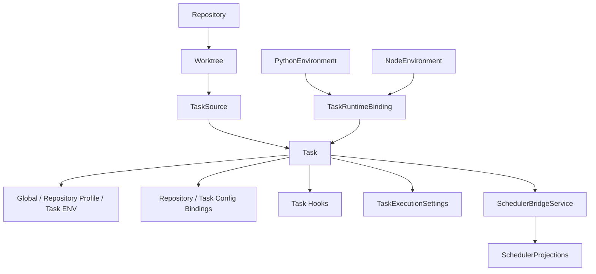
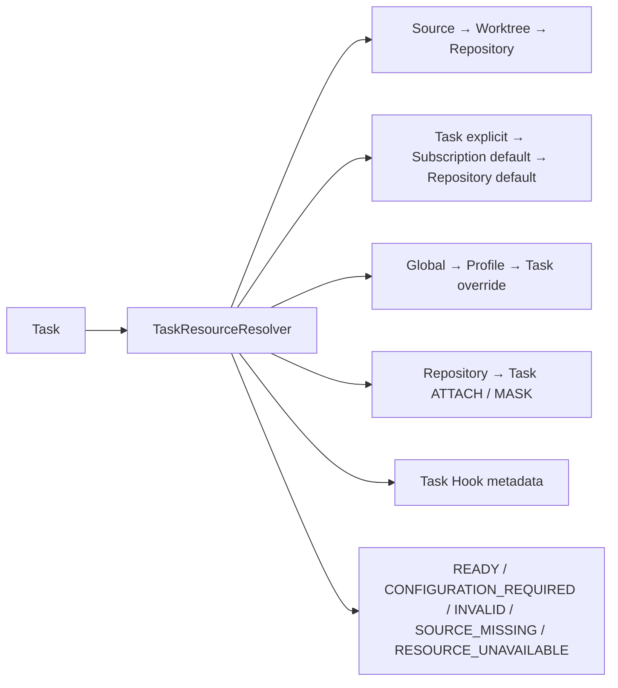
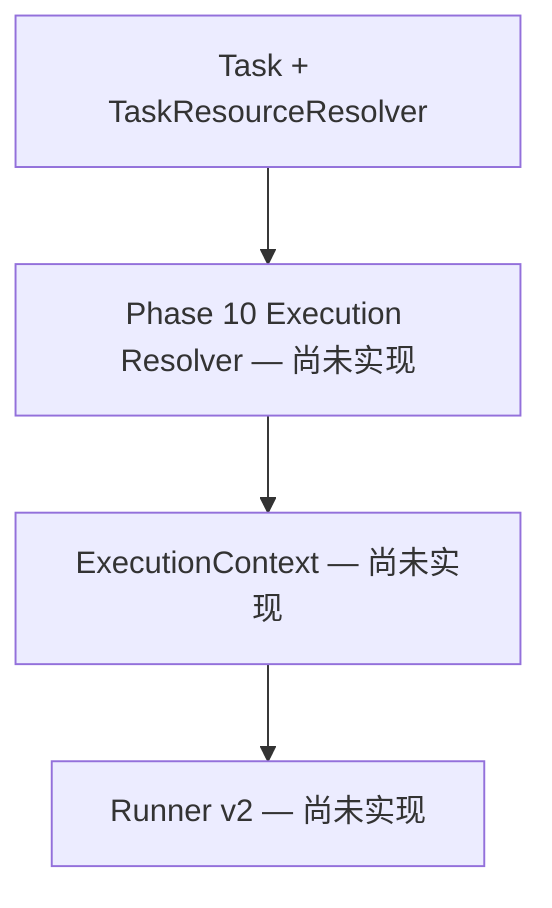

# Task Domain — Phase 9

Task 是定义的正式中心；SchedulerProjections、RunningInstances 与日志仍是临时执行桥。Task 定义没有绝对运行路径或 Build pin。

## 逻辑资源解析

## Phase 10 边界

Phase 9 不组合 executable、完整 ENV、Config revision、Hook snapshot 和 workspace lease。当前 `TaskExecutionBridge → CurrentTaskBridgeService → task.sh` 沿用现有执行方式；Python/Node Environment 绑定没有被当前进程消费。

API/UI、迁移、readiness 和桥接说明见 [Phase 9 文档](../refactor/phase9/01-task-domain.md)。
