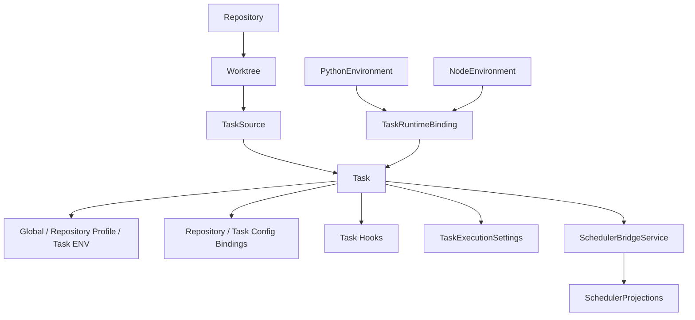
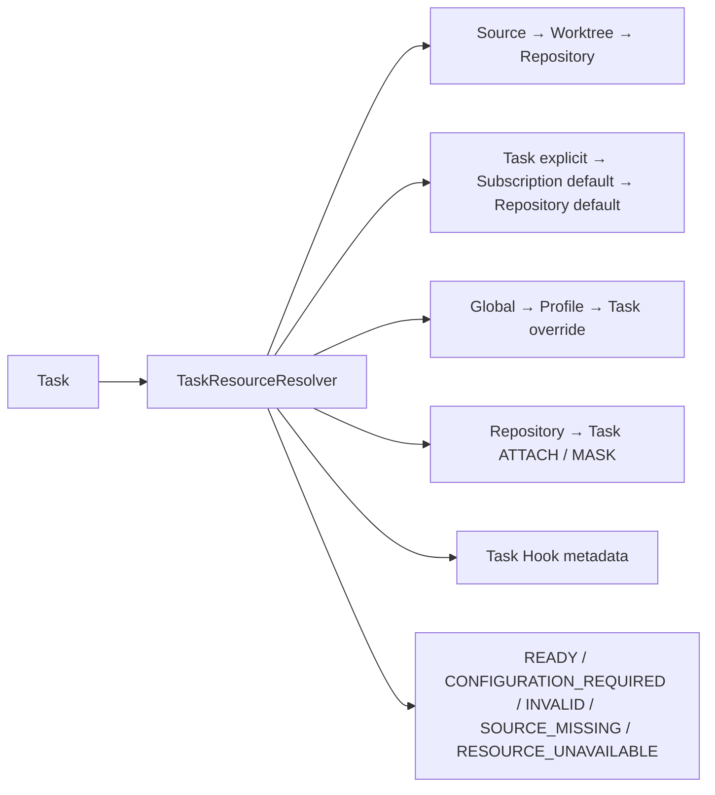
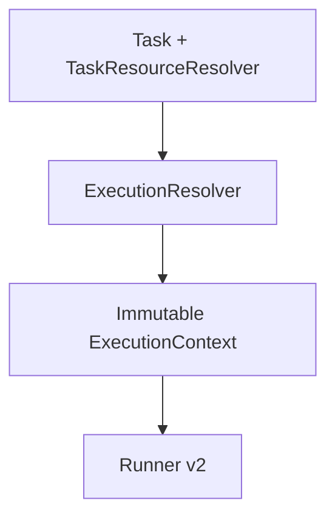

# Task Domain — Phase 9

Task 是定义的正式中心；SchedulerProjections 仅为调度输出，TaskRuns / TaskRunAttempts 承担执行。Task 定义没有绝对运行路径或 Build pin；这些属于运行快照。

## 逻辑资源解析

## Phase 10 边界

Phase 10 已实现 executable、ENV、Config revision、Hook snapshot 和 Worktree lease 的单次解析。当前 `TaskExecutionBridge → ExecutionService → Runner v2` 消费 managed Environment Build；正常执行不再调用 task.sh。详见 [Execution Engine](14-execution-engine.md)。

API/UI、迁移、readiness 和桥接说明见 [Phase 9 文档](../refactor/phase9/01-task-domain.md)。
