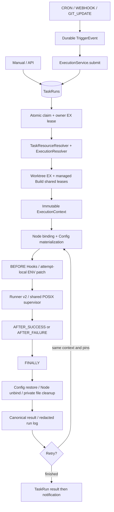

# Execution Engine — Phase 10

TaskRun / TaskRunAttempt 是唯一正常执行记录。TaskSource 直接指向 Worktree；ExecutionResolver 将逻辑资源绑定变成单次运行的不可变快照，Runner v2 执行绝对解释器和原生 argv。

- 配置优先级保持 Phase 9 单一解析器；运行快照在事务读取、FD 租约获取、复核后冻结。
- Python 使用 pinned venv；Node CJS / ESM / TS 使用 pinned Node Build，TS 要求真实 tsx。
- Worktree 在 retry backoff 期间仍锁定；Environment 推广不改变已运行的 Build。
- 控制器崩溃后，恢复必须先取得 owner EX 和 Worktree EX。只恢复已知 journal，不按持久化 PID 杀进程。
- 运行时 Hook Secret 保留在内存和受保护的临时协议文件；每 Attempt 后删除已知临时文件。TaskRun 数据库仅存脱敏 metadata 和结构化状态。
- system crond 输出为固定 backend Node + taskRunSubmit.js + 私有 socket 地址 + Task ID。Unix socket 目录 0700、socket 0600；没有 Shell→Open API 结果回环。
- 旧 Runner 的产品入口默认拒绝；物理删除最后一批进程/FD 恢复材料等待 Linux 实机 gate。Bootstrap、编辑器、显式 SDK 不由 Phase 10 误删。

实现与验收：[Phase 10 文档](../refactor/phase10/01-execution-engine.md)、[最终报告](../../PHASE10_REPORT.md)、[桥接登记](../../TEMPORARY_BRIDGES.md)。

Phase 11：submit 接收事件身份，检查 Task/Trigger enabled 和 readiness，以唯一 submission_key 在同一事务创建 Run 并关联事件。Runner、Context 与重试/并发职责不变。
