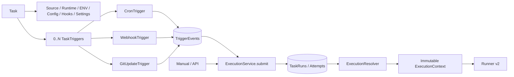
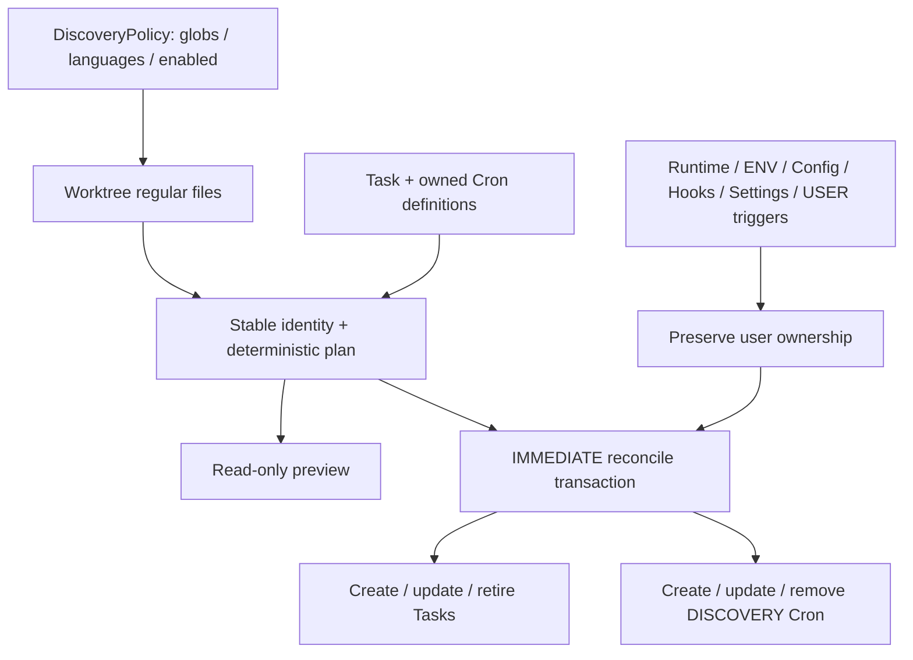
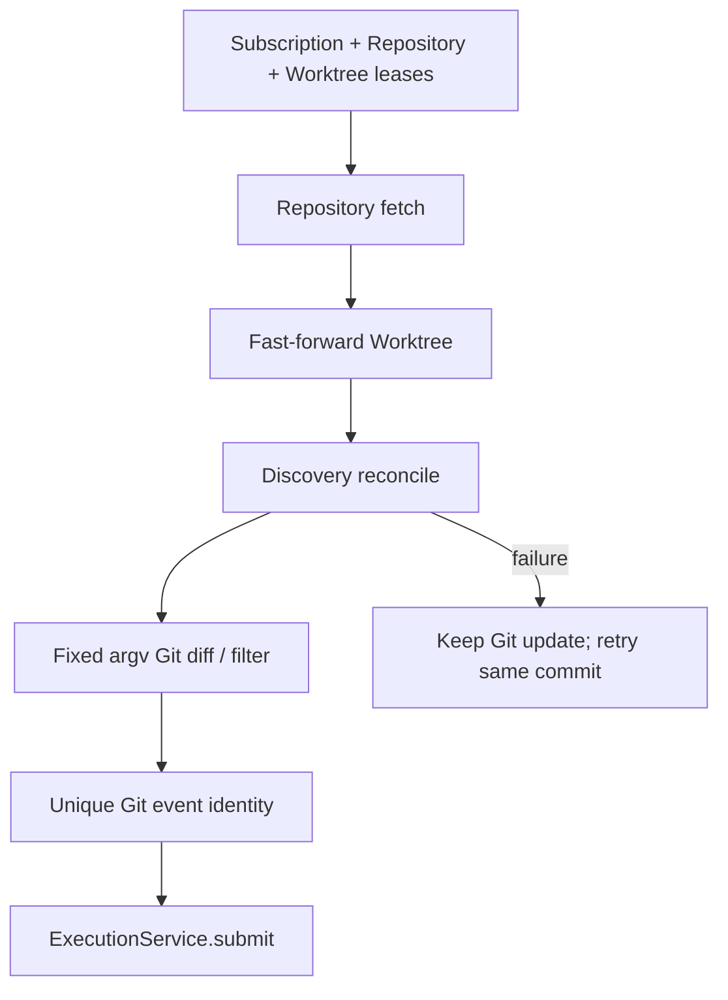
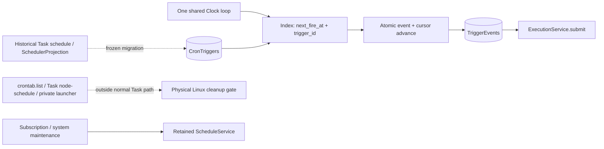

# Discovery v2 + Trigger Model — Phase 11

当前 schema v8。Task、Trigger、TriggerEvent、TaskRun 分离；执行核心继续采用 Phase 10 immutable Context 与 Runner v2。

## Trigger / Task / TaskRun

## Discovery flow

## Git update flow

## Scheduler transition

没有新执行器、消息队列、Task ENV 路径或源码 staging 层。详细契约与证据见 [Phase 11](../refactor/phase11/01-trigger-domain.md) 和 [报告](../../PHASE11_REPORT.md)。
