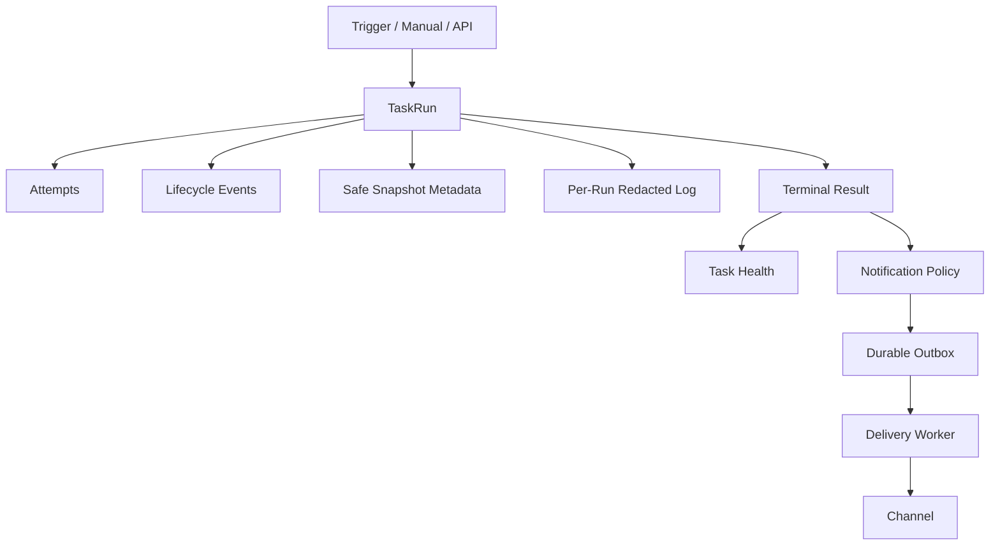

# TaskRun Observability — Phase 13

> Phase15 convergence: schema v9 remains unchanged. The current cross-domain ownership, physical bridge removals and operations contract are in [Platform overview](00-platform-overview.md) and [Platform operations](20-platform-operations.md). Earlier bridge-retention statements below are historical. Hosted Linux qualification is a separate gate in [Phase15](../../PHASE15_REPORT.md).

当前schema v9。TaskRun是唯一执行历史，RunObservability提供SQL历史/统计，TaskRunEvents提供少量生命周期Timeline，RunLogService提供文件增量读取。Health由终态维护，与resource readiness独立。

Runner保持spawn/monitor/result；Coordinator产生事件。终态SQLite trigger拥有run-health-outbox原子性。UI包含Runs、Task Runs/Health/Notifications、Dashboard以及Trigger双向定位。日志复用已认证SockJS，有界HTTP cursor负责断线恢复；没有stdout数据库行。

详细契约：[Phase13设计](../refactor/phase13/01-observability-domain.md)、[日志](../refactor/phase13/03-log-architecture.md)、[健康](../refactor/phase13/05-task-health.md)。保留默认OFF，无自动删除或Backup。
