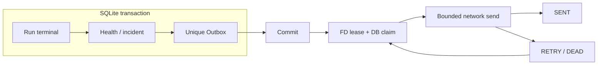

# Notification Platform — Phase 13

TaskNotificationPolicy + 显式Channel bindings → 原子Outbox → 独立Dispatcher → Provider → Delivery history。所有旧24种providers保留为独立每次请求adapter，另提供结构化WEBHOOK。Channel Secret复用protected SQLite，不从Task ENV读取。

网络不在DB事务或Execution终态路径。跨进程持有稳定FD lease，SENDING失去owner后持久化RETRY。durable at-least-once / internal dedupe；外部已收件但SENT前crash可能重复，WEBHOOK提供Idempotency-Key。有限重试用尽保留DEAD供人工重试。

Private webhook允许访问平台所在网络，禁止userinfo/non-HTTP/redirect，限时限响应，不称为完整SSRF隔离。旧登录/显式SDK系统通知为B13保留，Task通知完全使用新域。

参见[Policy](../refactor/phase13/07-notification-policy.md)、[Outbox](../refactor/phase13/08-notification-outbox.md)、[Delivery](../refactor/phase13/09-notification-delivery.md)、[Crash](../refactor/phase13/10-crash-recovery.md)。
