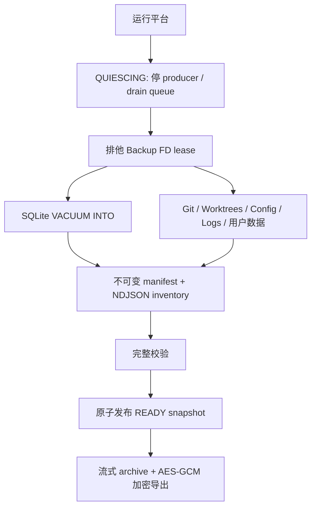
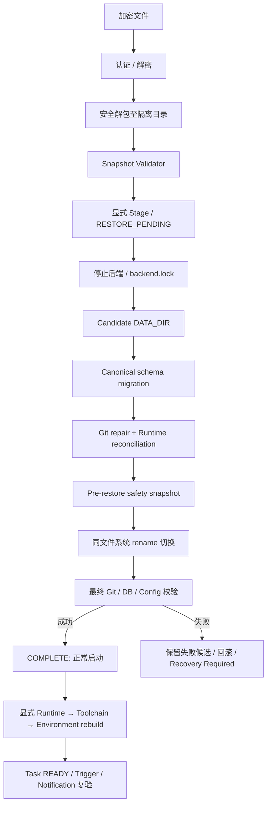
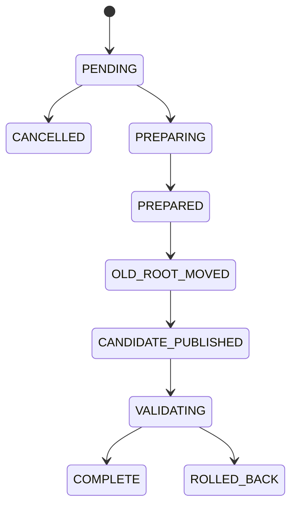

# Backup / Restore / Disaster Recovery

> Phase15 convergence: schema v9 remains unchanged. The current cross-domain ownership, physical bridge removals and operations contract are in [Platform overview](00-platform-overview.md) and [Platform operations](20-platform-operations.md). Earlier bridge-retention statements below are historical. Hosted Linux qualification is a separate gate in [Phase15](../../PHASE15_REPORT.md).

Schema v9。Backup/Restore 不引入第二套 Task、Runtime、Notification 或迁移引擎。

任何阶段中断由启动 bootstrap 读取外置 journal，用 ID 派生路径、SHA256 和 dev/ino 识别继续/回滚条件；不凭原绝对路径、PID 或目录名猜测。未知状态失败关闭，保留数据供修复。

文件日志延后到恢复完成和私有数据库准备之后启用，避免模块导入在离线切换前创建 DATA_DIR。primary / workers / 托管进程继承租约，正常业务启动不越过待恢复 journal。

生产契约、格式、安全界限和操作步骤见 [Phase 14 文档](../refactor/phase14/03-backup-coordinator.md)。实测结论见 [最终事实报告](../../PHASE14_REPORT.md)。
