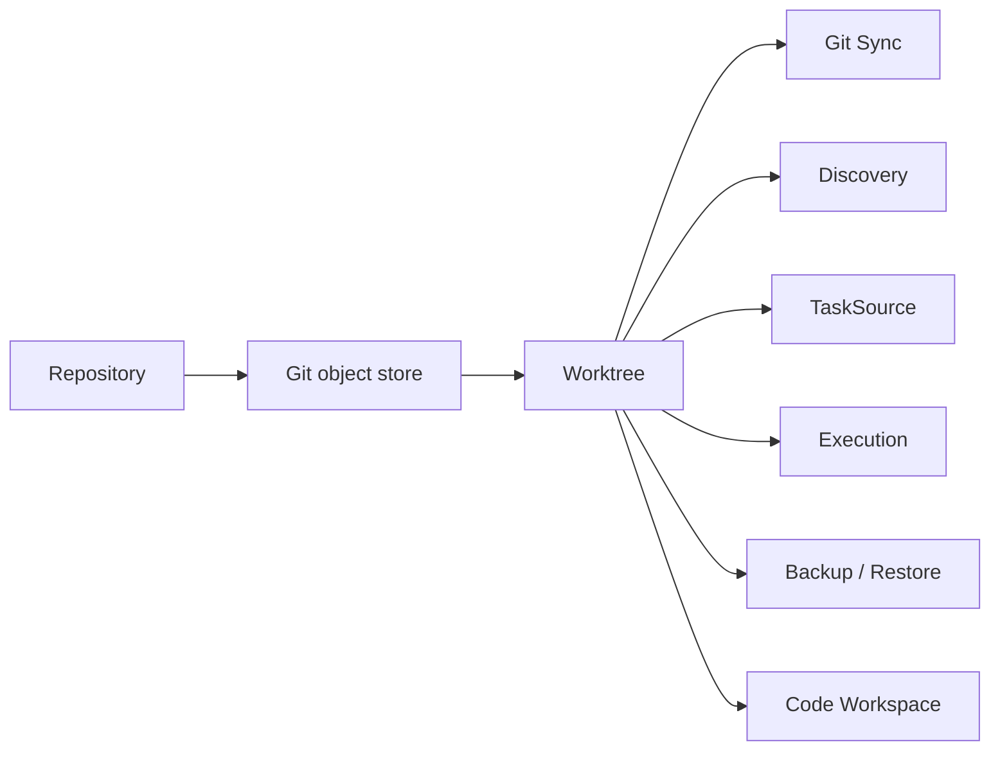
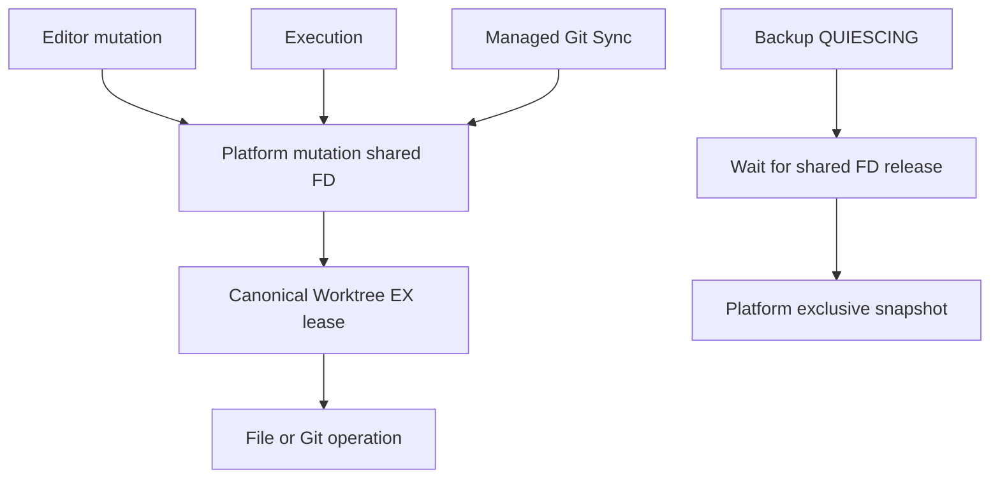
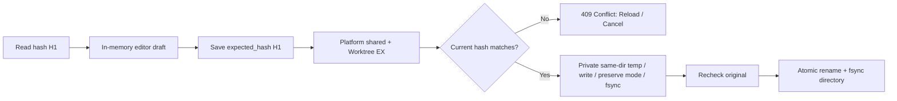
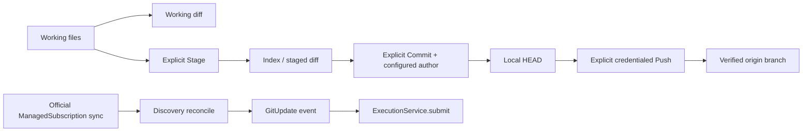

# Code Workspace — Phase12, schema v9

> Phase15 convergence: schema v9 remains unchanged. The current cross-domain ownership, physical bridge removals and operations contract are in [Platform overview](00-platform-overview.md) and [Platform operations](20-platform-operations.md). Earlier bridge-retention statements below are historical. Hosted Linux qualification is a separate gate in [Phase15](../../PHASE15_REPORT.md).

Workspace 是注册 Worktree 的文件/Git 操作视图，不持有另一份源码。生产入口、限制和验证见 [Phase12](../refactor/phase12/01-workspace-domain.md)。

文件 Save/Commit/Push 没有通向 GitUpdate 或 Run 的边。源码读取第一版也拿排他租约：执行时返回BUSY；残留材料化journal返回RECOVERY_REQUIRED，不显示临时Secret。B01 Editor退出，B14日志与Phase14完整备份继续承担各自职责。
