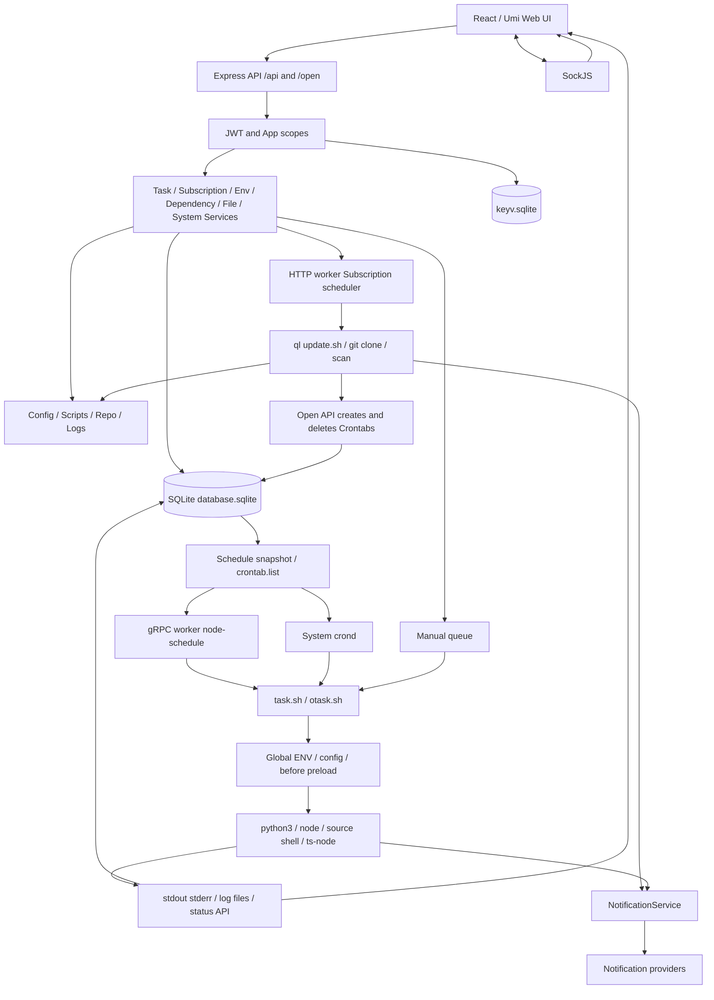

# Phase 0 — 当前架构

> Phase 0 历史快照：本文记录重构前基线。当前代码已新增 GitCredential / Repository、可空订阅引用及兼容适配器；现状增量、测试和限制见 [Phase 1 报告](../../PHASE1_REPORT.md)。旧执行管线保持基线行为。

审计基线：`4eb27427f809b565202f0b1bfa8129073f3fe5bd`，2026-09-15。结论来自当前源码；不以 README 或未来设计替代实现。Phase 0 不改变生产代码、模型、API 或 UI。既有未跟踪 `refactor/` 保留。

## 技术栈与启动

| 层 | 当前实现与证据 |
|---|---|
| Backend | TypeScript / Node.js，Express 4，TypeDI。`back/app.ts:Application.start` primary 先初始化 SQLite，再 fork gRPC worker，ready 后 fork HTTP worker；worker 故障重启并触发调度恢复 |
| Router / Service | `back/api/index.ts` 注册模块 Router；路由中 Celebrate/Joi 校验并 `Container.get(Service)`。没有独立统一 Controller 层；部分文件/仪表盘逻辑直接在路由中 |
| Storage | Sequelize 6 + sqlite3 (`@whyour/sqlite3`)，`database.sqlite`；Keyv + SQLite 的 `keyv.sqlite`，共享应用/token/语言缓存；文件配置、脚本和日志是另一组独立状态 |
| Scheduler | 系统 crond / node-schedule 双模式，gRPC 注册普通任务；订阅在 HTTP worker 的 ScheduleService 中由 node-schedule / toad-scheduler 调度 |
| Execution | cross-spawn + `/bin/bash`，`task` / `ql` Shell 包装器，Python/Node preload；p-queue-cjs 多个进程内队列，proper-lockfile 文件锁 |
| Frontend | React 18，Umi Max 4，约定式 pages 路由；`src/layouts/defaultProps.tsx` 产品导航；React hooks 页面本地状态，`src/layouts/index.tsx` 布局状态。没有发现独立统一 Redux store 作为当前页面主状态源 |
| API client / UI | `src/utils/http.tsx` Axios 拦截器、localStorage token、401 跳转；Ant Design 4 / ProLayout，Monaco/CodeMirror 编辑器，react-intl-universal |
| Realtime | SockJS，`back/loaders/sock.ts` / `back/services/sock.ts`，依赖安装、脚本运行、订阅结束消息；日志另有 HTTP chunk/offset 读取。未发现统一 SSE Runner 通道 |
| Git | `shell/share.sh:git_clone_scripts` 外部 Git CLI；`SshKeyService` SSH 配置与 private key 文件；没有 Git ORM/Repository/Worktree 资源 |
| Logging / Notification | Winston daily rotate system log；task 文件、subscription callback 文件、dependency DB JSON log；NotificationService 与 JS/Python notify 辅助代码 |
| Build / package manager | package.json 声明 pnpm 8.3.1 + frozen lock；`tsc -p back/tsconfig.json`→static/build，`max build`→static/dist；Docker 多阶段复制构建产物，PM2 ecosystem 管理入口 |
| Docker / Native | Alpine、Debian、Python 3.10/3.11 镜像变体；`shell/start.sh` 原生安装启动，存在 macOS/Termux Shell 分支，不等于所有原生平台完整支持 |

## 当前模块图

## 产品模块映射

| 模块 | Frontend | API / Service | 存储 |
|---|---|---|---|
| Dashboard | pages/dashboard | api/dashboard（聚合查询），services/metrics | CrontabStats/RunningInstances/Crontabs |
| Tasks / Crons / Views | pages/crontab | api/cron，CronService / CronViewService | Crontabs/CrontabViews，crontab.list |
| Subscriptions | pages/subscription | api/subscription，SubscriptionService | Subscriptions，repo/scripts/log |
| ENV | pages/env | api/env，EnvService | Envs，三份 preload 文件 |
| Dependencies | pages/dependence | api/dependence，DependenceService | Dependences，dep_cache / runtime 安装路径 |
| Scripts | pages/script | api/script，ScriptService | scripts/，文件操作及手工运行 |
| Configs | pages/config | api/config，ConfigService | config/，特殊 scripts 路径 |
| Logs | pages/log | api/log，LogService；cron/subscription 日志路由 | log/，syslog/ |
| Notifications | pages/setting/notification | api/user，UserService / NotificationService | Auths notification JSON |
| Applications / API | pages/setting/appModal | api/open，OpenService | Apps / Keyv |
| System / cache / retention | pages/setting | api/system、retention、update，SystemService / RetentionService | Auths，文件、缓存、统计 |
| Authentication / 2FA / login history | pages/login、initialization、setting/security、loginLog | api/user，UserService / shared/auth/password | Auths，Keyv，token.json |
| 其他 | pages/diff（对比工具），错误页 | health/clientIp，监控/客户端 IP 配置 | 内存度量、系统配置 |

## Authentication / permission boundary

`back/loaders/express.ts`：`/api` JWT HS384 + 当前 session 校验；`/open` 先核对 Apps token 过期时间和第一段资源 scope，再 rewrite 到 `/api`。应用 scopes 来自 `back/data/open.ts`：envs/crons/configs/scripts/logs/system/dashboard。单管理账户数据放 Auths.authConfig，未实现 Repository/Task 级 RBAC 或多租户隔离。用户登录密码使用 scrypt，旧明文密码成功登录后迁移（`shared/password.ts`、`UserService.authenticate`）；这不表示 ENV/订阅凭证已加密。

## Architecture Decision Log

- P0-01：数据库与生成文件、Shell API 的循环依赖作为兼容基线保留。
- P0-02：验证只使用临时目录、fixture、假 token/空通知 client；不启动真实面板或接触已有 repo/secret。
- P0-03：`repo` 是可替换拉取快照，任务常在 `scripts` 副本执行；未来 Worktree 设计不能把二者直接等同。
- P0-04：发现缺陷记录为风险和 characterization，不在本阶段修复。
- P0-05：GitNexus MCP 未暴露，本地 `.gitnexus/run.cjs`、`.claude/skills/gitnexus/*` 不存在；采用入口/调用链/源码和运行证据补充，未修改既有符号、未提交 commit。GitNexus 图覆盖尚待后续可用环境补验。
