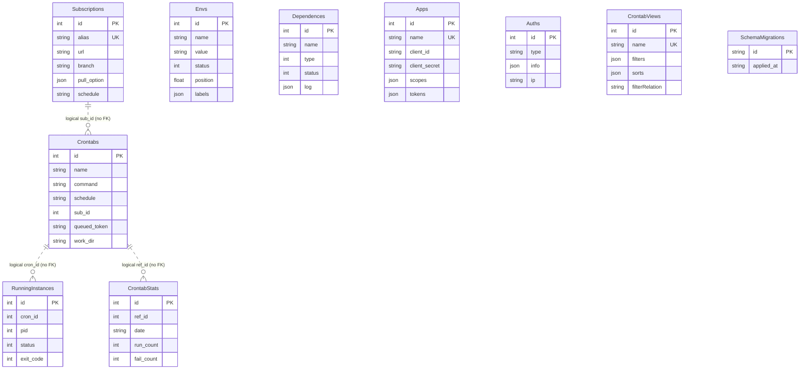

> **Historical Refactor Records — Greenfield Direction (Phase 4.5A)**
> 本文保留历史实现与验证证据；其中 QingLong compatibility / migration / legacy behavior preservation 不再是现行设计要求。新方向仅支持 Fresh Install，见[平台架构](../architecture/00-platform-overview.md)。当前仍被使用的桥接层按删除计划与退出 gate 保留，不能依据此标记直接删代码。

# SQLite / 数据模型审计

> Phase 0 历史快照：本文记录重构前基线。当前代码已新增 GitCredential / Repository、可空订阅引用及兼容适配器；现状增量、测试和限制见 [Phase 1 报告](../../PHASE1_REPORT.md)。旧执行管线保持基线行为。

## 数据库与真实表

`back/data/index.ts` Sequelize 指向 `join(config.dbPath,'database.sqlite')`。`back/shared/store.ts` KeyvSqlite 指向 `keyv.sqlite`。`back/config/index.ts` 的 sample/database.sqlite 是样本路径，不是当前主库。未读取任何用户数据库。真实表名通过 Sequelize.getTableName + 临时 SQLite sync 验证，不按业务名称猜测。

| Table | Model / 文件 | 目的/重要字段 | 主键/关系 | Created / Read / Updated / Deleted by |
|---|---|---|---|---|
| Crontabs | CrontabModel，data/cron.ts | 任务定义与当前执行指针，command/schedule/sub_id/hooks | 自动 id；sub_id 是逻辑关联，无 FK | CronService.create（手工+Open API）；crontabs/getDb、runCron、dashboard；update/status/启禁；remove |
| Subscriptions | SubscriptionModel，data/subscription.ts | 拉取来源、凭证、筛选、调度 | 自动 id；alias unique | SubscriptionService.create；list/getDb/initTask；update/status/taskCallbacks；remove |
| Envs | EnvModel，data/env.ts | name/value/status/position/remarks/isPinned/labels/timestamp | 自动 id；name+value unique，无 scope FK | EnvService.create；envs/set_envs；update/启禁/排序/标签；remove |
| Dependences | DependenceModel，data/dependence.ts | name/type/status/log(JSON)/remark/timestamp | 自动 id，无 repo/runtime FK | DependenceService.create/insert；dependencies；install/status/updateLog；remove/removeDb |
| Apps | AppModel，data/open.ts | name/scopes/client_id/client_secret/tokens(JSON) | 自动 id，name unique | OpenService + initData system app；token鉴权/列表；更新/token发放；OpenService 删除 |
| Auths | SystemModel，data/system.ts，define('Auth') | ip/type/info(JSON)；认证、通知、系统配置、登录日志 | 自动 id；type 非独立账户 FK | initData/UserService/SystemService；shareStore填充、鉴权/设置；UserService/SystemService/RetentionService；登录日志清理等显式 destroy |
| CrontabViews | CrontabViewModel，data/cronView.ts | name/position/isDisabled/filters/sorts/filterRelation/type | 自动 id，name unique | CronViewService + initData；视图列表；update/排序；remove |
| CrontabStats | CrontabStatModel，data/cronStats.ts | ref_id/date/run_count/success_count/fail_count/total_time/max_time | 显式 INTEGER 自增 id；ref_id+date unique；逻辑 cron 关联 | api/dashboard POST record；dashboard 聚合；增量统计；RetentionService |
| RunningInstances | RunningInstanceModel，data/runningInstance.ts | cron_id/pid/log_path/started_at/finished_at/status/exit_code | 自动 id；逻辑 cron 关联 | CronService.status running；dashboard/cron API；status/stop/stopInstance/initData/runCron；RetentionService |
| SchemaMigrations | 无 ORM Model，shared/schemaMigrations.ts | id/applied_at | TEXT id PK | migrateSchema 建表/insert/read；不自动删除旧 migration |
| keyv（keyv.sqlite） | KeyvSqlite adapter，shared/store.ts | key/value 序列化缓存，apps/authInfo/lang | adapter key；非业务 FK | shareStore.updateApps/updateAuthInfo/setLang；鉴权和语言读取；set 覆盖；adapter管理 |

主库 ORM 模型默认 createdAt/updatedAt 时间戳，默认 id INTEGER 自增（CrontabStats 显式定义）。各 Model 没有 belongsTo/hasMany 或 references；下图是逻辑关系，不是数据库强制级联。历史统计可保留已删除 task 的引用。删除行为由 Service 显式协调。

## Crontabs 全字段解释

| 字段 | 语义 |
|---|---|
| id | ORM 自增主键，Shell ID 与 gRPC string id 的来源 |
| name | 显示名称；与 command/schedule 组合 unique |
| command | 用户命令，constructor trim；不是结构化 executable/args |
| schedule | cron / once / boot 特殊类型；与 name/command 组合 unique |
| timestamp | constructor new Date().toString()，不是 ORM createdAt |
| saved | crontab.list 同步标记；setCrontab 后 true |
| status | running=0、idle=1、disabled=2、queued=3 |
| isSystem | 系统标记 0/1 |
| pid | 当前执行进程指针；不能替代多实例历史 |
| isDisabled | 调度启禁标记，与 status 分开 |
| isPinned | 列表置顶 |
| log_path | 当前/最近日志相对路径 |
| queued_token | 手工 queued snapshot UUID，条件认领/清理，constructor 不主动初始化 |
| labels | JSON string[] |
| last_running_time | 上次运行耗时，由 Shell 状态回报 |
| last_execution_time | 上次执行时间戳；实际状态 API 写入语义见 CronService.status |
| sub_id | 可空 Subscription 逻辑归属 |
| extra_schedules | JSON 额外 schedule 列表 |
| task_before / task_after | 命令字符串，单引号转义后通过环境前缀传 Shell |
| log_name | 自定义日志目录，可有 /dev/null 特例 |
| allow_multiple_instances | 0/1；runCron 中影响旧进程替换 |
| work_dir | 自定义工作目录，绝对路径或 scripts 下相对路径 |
| createdAt / updatedAt | Sequelize 自动维护日期 |

Crontabs 没有独立 exit_code 字段：exit_code 存 RunningInstances，日统计另存 CrontabStats。不能用 Crontab idle 或外层 shell exit 0 判定脚本成功。

## Subscriptions 全字段解释

| 字段 | 语义及实际映射 |
|---|---|
| id / createdAt / updatedAt | ORM identity / timestamps |
| name | UI 名称，constructor 默认 alias |
| type | public-repo/private-repo/file；生成 ql repo 或 ql raw |
| url | Git 或 raw URL，可直接包含凭证 |
| branch | git clone -b，且 Shell 目录后缀原样追加 |
| whitelist / blacklist | egrep 包含/排除正则 |
| dependences | repo 辅助文件复制正则，非包安装 |
| extensions | find 扩展名，管道分隔符会转空格 |
| schedule_type / schedule / interval_schedule | crontab 或 interval {type,value}；映射 node-schedule/toad |
| status / pid / is_disabled | running=0、idle=1、disabled=2、queued=3；进程与启禁 |
| pull_type / pull_option | ssh-key/private_key 或 user-pwd/username/password，JSON 明文 |
| alias | DB unique；SSH host alias、Service 日志/force 删除目录；Shell clone 另算 uniq_path |
| log_path | 最近订阅日志 |
| sub_before / sub_after | 主拉取之外的 exec 命令 |
| proxy | clone proxy / SSH ProxyCommand 输入 |
| autoAddCron / autoDelCron | 数值 flags；formatCommand 转字符串 boolean |

class 的 command 是运行时计算字段，SubscriptionModel 未定义持久化 command 列。复合 unique 为 name/url/schedule/interval_schedule；可空字段与 SQLite NULL unique 语义不能代替稳定 Repository identity。

## Auth / User / Notification 与迁移

没有 User 表或 Notification 表。AuthDataType 把 loginLog、authToken、notification、removeLogFrequency、systemConfig、authConfig 分装在 Auths.info。AuthInfo 含 username/password、retries、token/tokens、2FA secret、avatar、blockedIps；SystemConfigInfo 含 cronConcurrency、mirrors/proxy/timezone、globalSshKey 和 retention。Apps tokens 包含 value/type/expiration。

`back/loaders/db.ts` 依次 sync 九个 model 后 `migrateSchema`。后者在 IMMEDIATE transaction 内检查 PRAGMA table_info、补列并记录固定 migration id，不能重排/复用 id。SQLite SQLITE_BUSY 最多重试 10 次；pool 配置不等于并行写事务。Phase 0 不修改 schema 或已有迁移。
