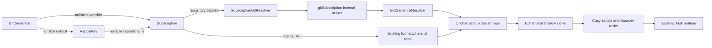
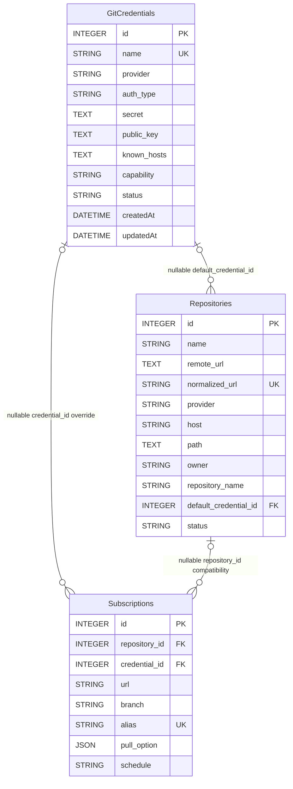

# Repository model and implemented architecture

`RepositoryService` owns metadata, normalization, uniqueness, default credential relation and manual access tests. `SubscriptionService` only chooses the legacy command or internal resource adapter; credentials and repository identity live in separate services.

`Repositories` has no branch, clone path, bare store or worktree field. `normalized_url` is unique. Name changes do not change identity. `remote_url` is immutable after creation, to avoid silently changing transport and existing checkout spelling. Default credentials may change without changing repository ID. NULL means anonymous.

Status is `unknown` initially, `available` or `unreachable` after manual test. Authentication and network failures deliberately share a static failure message; no potentially secret-bearing remote error is returned. Lists query local DB only. Deletion is metadata-only and rejects referenced repositories; it never deletes subscriptions or filesystem paths.

Foreign keys use RESTRICT, and service operations check references transactionally. API `GET /api/repositories/:id` includes `subscriptions_count`.
