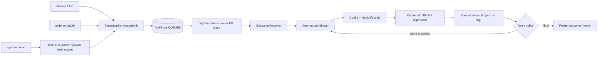

# Phase 10 — 执行引擎

Task 是定义；TaskRun 是持久化提交；TaskRunAttempt 是一次实际尝试。ExecutionService 是唯一执行控制器，定时调度仅提交 Task ID，不持有 MAIN 命令。

Dispatcher 独立于 scheduler，每 250ms 扫描，单进程最多 8 个活跃执行。跨进程所有权由文件租约和数据库条件更新共同保证。进程内 Map 只用于通知与取消，不承担全局互斥。
