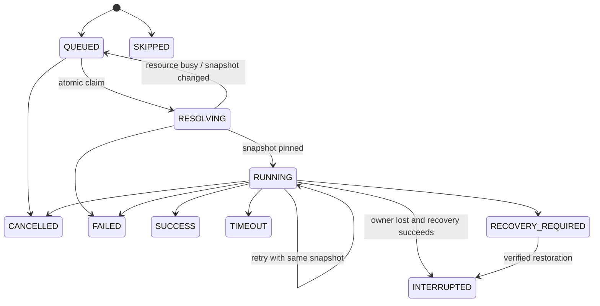

# Phase 10 — TaskRun 与 Attempt

TaskRuns 保存提交方式、状态、时间、尝试数、定义版本、快照 metadata、日志 identity、取消请求、并发策略、所有权 token 及最终结果。TaskRunAttempts 对 (task_run_id, attempt_number) 唯一。

活跃 Task 删除被数据库 guard 拒绝；终结后的历史 run 保留，Task FK 可 SET NULL。活跃/recovery run 持有 Worktree FK，禁止进入 DELETING。保留历史日志，不以删除 Task 为隐式清理授权。
