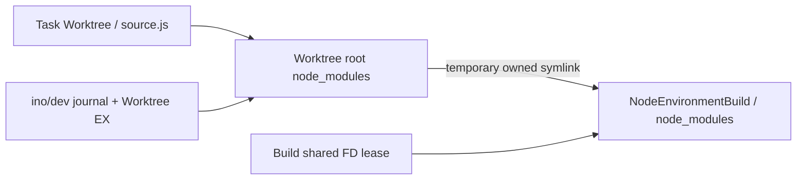

# Phase 10 — Node 模块绑定

Worktree 根的 node_modules 临时绑定到 pinned Build 的 node_modules。Node 原生 CJS/ESM 搜索及真实 tsx 因此使用同一 Build，不使用 NODE_PATH、全局包或 npx。

绑定流程：持 Worktree EX → 检查冲突 → 写私有 journal → 建 staging symlink → 保存 ino/dev → 通过复用 config_link.py 排他安装 → 删除 staging link。journal 保存根、目标、staging 名及 inode 身份。

清理/恢复只删除 journal 身份、link target 都匹配的链接。Worktree 内任意已有用户 node_modules、不明替换或不匹配 journal 失败关闭，绝不 rm -rf 用户模块树。Config 的保留路径规则禁止覆盖 .git、平台内部名和根 node_modules。

