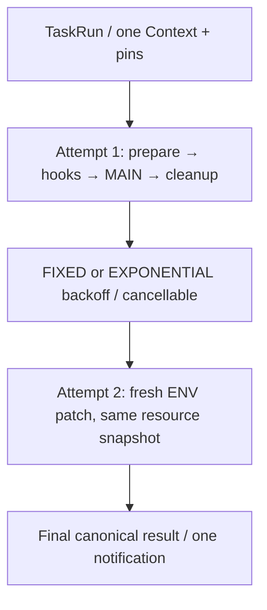

# Phase 10 — 重试、并发与取消

max_attempts 表示包含首次的总次数。固定或指数 backoff 上限 3600 秒；backoff 可以立即取消且继续持有资源 pins。

重试仅限普通非零退出、监督超时和 Hook 执行失败，且 CLEANUP 成功。协议错误、安全/路径错误、取消、中断、恢复冲突不自动重试。AFTER_SUCCESS / AFTER_FAILURE 分支由主流程结果选择；FINALLY 和 CLEANUP 独立收敛。

FORBID 对已有 pending Run 产生持久化 SKIPPED；QUEUE 按 Task 的 Run ID FIFO；ALLOW 可并行不同 Workspace。SQLite IMMEDIATE 事务协调跨进程提交/claim，owner FD lease 防止双重所有权。

取消写 cancel_requested；拥有者轮询并通知当前 supervisor。QUEUED 不创建 Attempt；backoff 不产生下一 Attempt；终态取消无副作用。只控制当前活跃 supervisor，不从数据库读 PID 杀进程。

