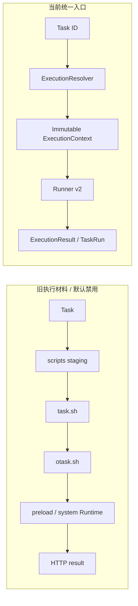

# Phase 10 — 桥接退出

本阶段移除旧 Runner 的产品入口职责，保留尚未通过 Linux destructive removal gate 的最小源码/恢复测试材料。

| Bridge | Phase 10 状态 | 仍存在的消费者 |
|---|---|---|
| B01 staging | REDUCED | 编辑器、订阅发布/历史辅助文件；Runner v2 不消费 |
| B02 task.sh/otask.sh | DISABLED / BLOCKED_BY_LINUX_GATE | 显式 PLATFORM_RECOVERY_TEST_ONLY 诊断；正常 Task 不调用 |
| B03 crontab | REDUCED | Task ID launcher 派生输出 |
| B04 scheduler adapters | REDUCED | 定时/订阅 transport；不再执行 MAIN |
| B06 preload | DISABLED FOR TASKS | 历史恢复材料/SDK，Runner v2 不注入 |
| B08 Shell status loopback | REMOVED FROM NORMAL EXECUTION | 保留旧协议材料；结果改为 TaskRun |
| B09/B10 global dependencies | REDUCED | 平台 bootstrap、旧管理/恢复材料；managed Task 无依赖 |
| B13 notification SDK | RETAINED | 显式脚本 SDK 后续 Phase 13 处理 |
| B14 log identity | REPLACED FOR TASK RUNS | 新 run ID 日志；订阅/历史日志保留 |
| B15 RunningInstances/stats | REDUCED | 历史 DTO / dashboard；新执行无写入 |
| B17 scripts workspace bridge | REPLACED FOR TASK RUNS | 旧恢复测试；新链使用 Worktree |

Config journal、FD helpers、process-group supervisor 是活跃安全组件，不是可随 legacy 删除的无用文件。未删除既有用户数据。

