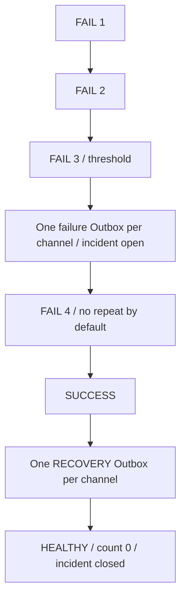

# Task Health / Incident

TaskHealthStates 每 Task 一行：last_run_id、last_terminal_status、last_success_at、last_failure_at、consecutive_failures、health_state、failure_alert_open、updated_at。

FAILED/TIMEOUT/INTERRUPTED 递增连续失败并设 FAILING；SUCCESS 清零并设 HEALTHY；CANCELLED/SKIPPED 更新最后终态但保留健康/连续计数。无执行结果为 UNKNOWN。Readiness 与此独立。

Health 按终态提交顺序更新，ALLOW 并发按 SQLite 提交顺序串行处理。迁移按 finished_at、id 排序，SQL 聚合最后成功之后的失败；同时间以 ID 决定顺序。

达到 failure_threshold 且实际生成失败 Outbox 后打开 incident。没有匹配 Channel 不打开虚假 incident。默认新 Policy preset repeat_every_failures=0，后续失败不重复；成功关闭 incident。恢复通知仅在真实 incident 打开且 notify_recovery 时生成，并替代普通 SUCCESS。

