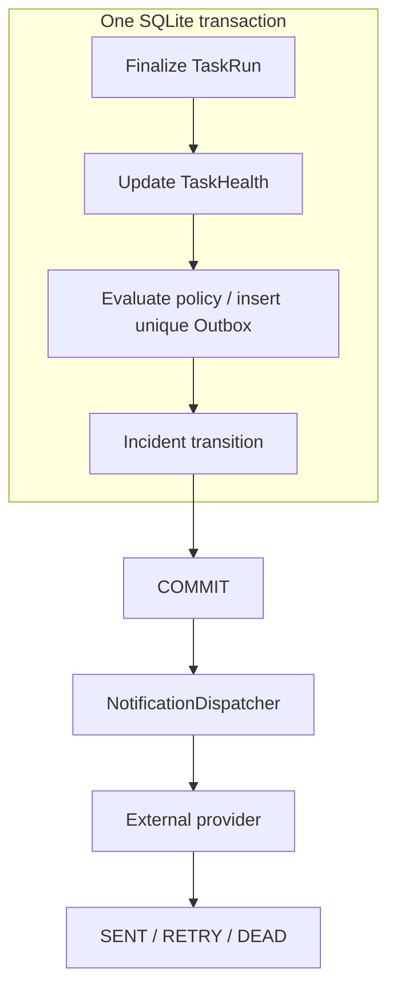

# Durable Outbox / Atomic Boundary

NotificationOutbox：event_type、task/run/channel FK、UNIQUE dedupe_key、safe message、status、attempt_count、next_attempt_at、claim token/times、sent_at、static last_error_code。去重键 Run:event:channel，测试消息使用独立随机身份。

SQLite AFTER UPDATE terminal trigger 与直接 terminal INSERT trigger 覆盖成功、失败、超时、取消、恢复等正式路径。在原 TaskRun 事务内完成 Health 更新、Policy evaluation、Outbox INSERT、incident transition。任何失败完整回滚；不在事务中发送网络请求。

message 仅 event、Task ID/name、Run ID/status/trigger/time/duration/attempt/error code；没有 ENV/Config/Hook/credential/payload/stack。Outbox message 不从 Runner 临时 Context 拼接。

投递保证：**durable at-least-once delivery with internal deduplication**。有限重试用尽为 DEAD，保留待人工处理；不承诺无限自动重试或外部 exactly-once。
