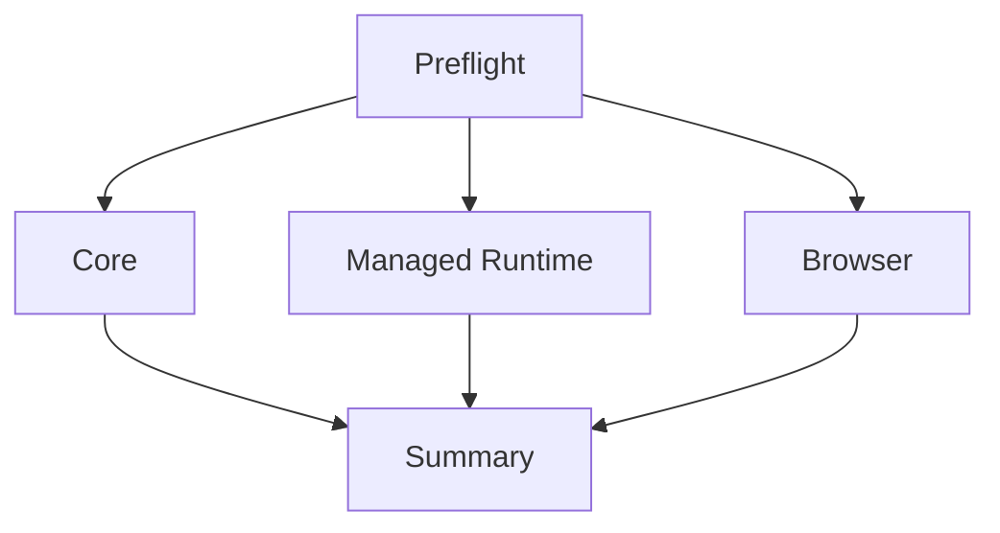

# CI architecture

测试逻辑位于 scripts/ci；GitHub Actions 仅编排。固定 Ubuntu24.04/Node22.23.2，preflight完成后core、managed-runtime、browser按scope独立运行；最后always summary。每job重建依赖与自己的操作数据，不传递数据库、Worktree或运行时安装。

旧validate.yml为REPLACE/MERGE，旧Docker+镜像同步workflow为ARCHIVE：原文移至.github/archived-workflows/*.disabled，不再因push自动执行。没有实现新发布系统。Phase15以后再决定恢复何种发布流程。
