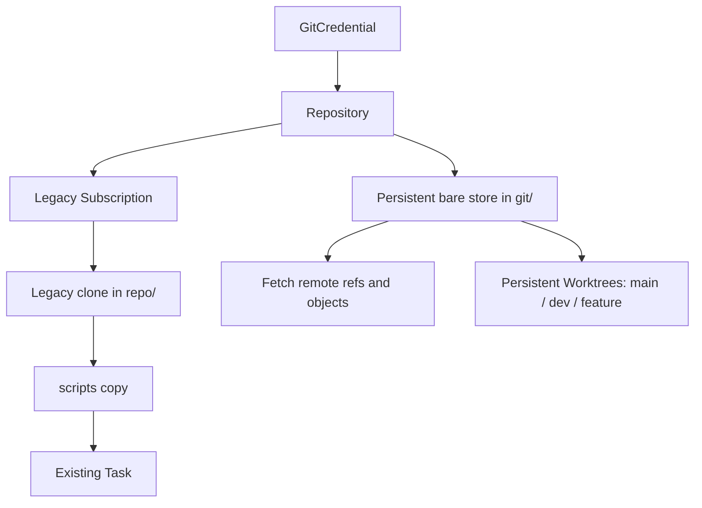

# Repository Storage

Phase 2 extends the Phase 1 `Repositories` table; it does not introduce another repository identity. Creating metadata is offline and leaves storage UNINITIALIZED. Explicit `RepositoryStorageService.initialize(id)` is the idempotent storage entry point.

There is no Worktree → Task or Subscription → Worktree integration in Phase 2.

## Initialization and fetch

Under a repository mutation lock: reserve storage state/path, exclusively create the directory, `git init --bare`, write `qinglong.repositoryId`, add clean origin, configure remote tracking refs, fetch. This is the persistent equivalent of cloning bare, with remote branches deliberately stored under `refs/remotes/origin/*`.

Fetch runs `git fetch --prune origin +refs/heads/*:refs/remotes/origin/* +refs/tags/*:refs/tags/*`. It downloads objects, updates remote branches/tags and prunes deleted remote refs. It never moves a checked-out local branch, resets a Worktree, or deletes/reclones storage. Remote HEAD is resolved with `git remote set-head origin --auto`.

Each network operation resolves the current Phase 1 credential. Credentials never enter origin URLs. Local diagnostics/update/delete use an anonymous local command context so a disabled remote credential does not prevent offline recovery.

## State and metadata

UNINITIALIZED → INITIALIZING → READY; READY → FETCHING → READY/ERROR; absent initialized storage → MISSING; deletion → DELETING. Diagnostics reconcile cached state against disk. DB metadata is not proof that files exist.

Cached: storage_path, storage_state, last_fetch_at/status, last_error, default_branch, last_known_remote_head, remote_refs_count, tags_count. Git remains the source of truth for refs. No full refs table exists.

`changeRemote` accepts only an equivalent normalized identity. While legacy subscriptions reference the resource, even equivalent spelling changes are rejected to preserve their existing URL-based naming. Credential changes remain available through Phase 1. Interrupted DB/config updates can be reconciled with Repair Metadata.

Deletion checks Subscription and Worktree references, verifies ownership, rejects orphan Git registrations, removes only the managed bare directory, then deletes the row. A filesystem-success/DB-failure retry is supported.
