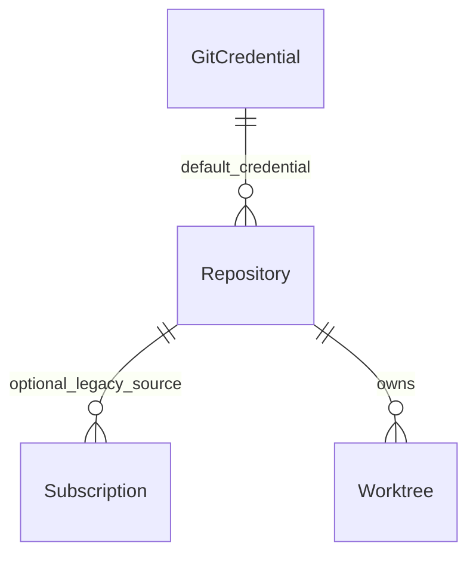

> **Historical Refactor Records — Greenfield Direction (Phase 4.5A)**
> 本文保留历史实现与验证证据；其中 QingLong compatibility / migration / legacy behavior preservation 不再是现行设计要求。新方向仅支持 Fresh Install，见[平台架构](../../architecture/00-platform-overview.md)。当前仍被使用的桥接层按删除计划与退出 gate 保留，不能依据此标记直接删代码。

# Worktree model and relation ADR

A Worktree has its own integer ID, repository_id, display name, ref_type/ref_name, generated local branch, unique branch_key, cached commit, initial target_commit, local_path, managed flag, lifecycle_state, dirty_state, status_snapshot, last_update_at, last_error and timestamps.

Branch Worktrees track a remote branch such as `feature/totp_login`. Their local branch is `ql-worktree-ID`, their path is `wt-ID`; neither is the remote branch string. A nullable unique branch_key enforces one managed Worktree per repository/remote branch. Tags and full commit SHAs create detached Worktrees and may have multiple instances. Local branches share the bare object store through native `git worktree add`.

## ADR: additive RESTRICT foreign key

Phase 1 already established real RESTRICT relationships for these new Git resources. Worktrees extends that boundary with `repository_id REFERENCES Repositories(id) ON DELETE RESTRICT`; no cascade is added. Services also reject deletion while referenced and serialize mutations. No legacy Task/ENV relation is changed.

Migration `phase2-workspace` runs within the existing migration transaction, adds repository columns and creates Worktrees/indexes. Fresh legacy databases pass all preceding migrations; Phase 1 databases upgrade additively; rerunning is safe. Existing rows default to UNINITIALIZED. The migration ledger now has 19 entries.

Cached status is a diagnostic convenience, not authority to overwrite data. Mutations recompute status while holding locks.
