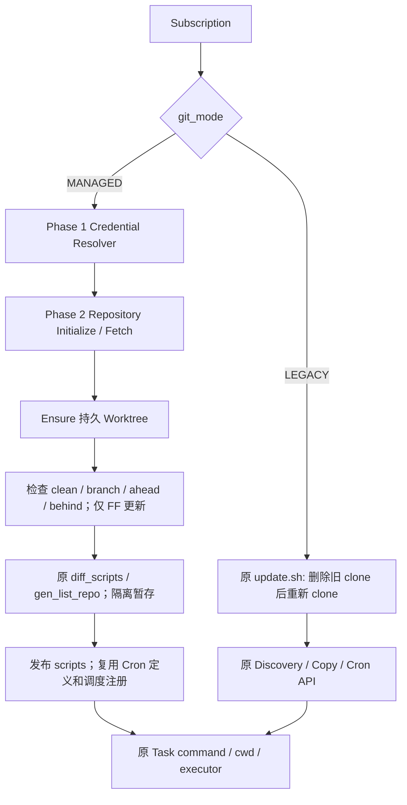

# Managed Git 管线

调度器和队列入口不变。Repository 订阅仍由内部 `gitSubscription` helper 在执行时读取 ID 对应的数据；仅 MANAGED 分支调用新服务。Legacy helper 延迟加载 Managed 服务，继续使用原位置参数调用 update.sh。

顺序为订阅互斥、解析凭证、必要时初始化、fetch、ensure、检查本地状态、FF-only、发现暂存、源状态复核、scripts/Cron 发布、记录成功。任何 Git 阶段失败都不会进入发现、复制或 Task diff。不会因为提交未变化跳过发现，避免上次发布失败后无法重试。

日志记录阶段、订阅与 Worktree ID、前后提交以及添加/删除数量。原 before/after 回调、订阅日志和任务结束事件继续由原调度流程负责。原扫描器生成的通知在发布完成后发送；通知失败只记录警告。
