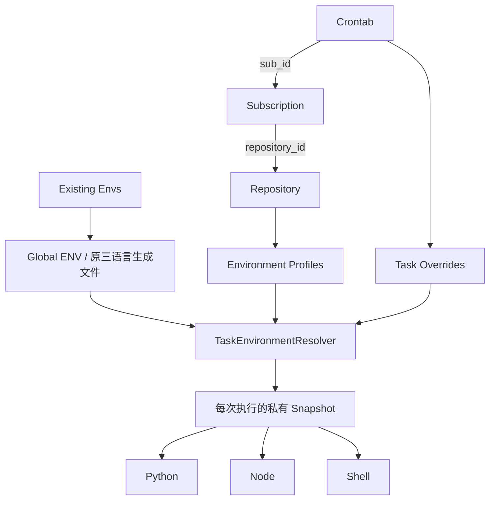

# Scoped ENV 数据模型

基线 `998a4d66`，Phase 4 保留 Envs 为唯一 Global 数据源，不复制、不迁移旧值。

| 表/字段 | 约束和用途 |
| --- | --- |
| EnvironmentProfiles | repository_id、name 唯一；description、enabled/disabled、createdAt/updatedAt |
| RepositoryEnvVariables | profile_id、name 唯一；value TEXT、operation、status、is_secret、position、labels、时间戳 |
| TaskEnvVariables | cron_id、name 唯一；变量字段同上；删除 Crontab 时 CASCADE |
| Repositories.default_env_profile_id | 可空；唯一默认来源，is_default 在 DTO 派生，不维护第二个布尔真相源 |
| Subscriptions.env_profile_id | 可空；订阅级覆盖 |
| Crontabs.env_profile_id | 可空；任务级覆盖；未增加 Task repository_id |

Profile → Repository 为 RESTRICT；变量 → 所属 Profile/Task 为 CASCADE；默认/订阅/任务 → Profile 为 RESTRICT。删除 Subscription 不删除 Profile。Repository 存在任何 Profile 时先阻止删除，用户先解除绑定并删除 Profile。

迁移 `phase4-scoped-environment` 在原 SQLite 事务内运行；账本共 21 项。旧绑定全部 NULL，变量表为空；不会自动启用任何旧任务的 Scoped ENV。旧 Envs、命令、调度与目录不变。迁移失败整体回滚，重复执行幂等。

唯一索引前缀分别服务 repository_id、profile_id、cron_id 查询；另外建立三个 binding 索引。EXPLAIN QUERY PLAN 测试确认按 scope 查询使用索引。列表使用批量 SQL，不逐任务调用 Resolver。首次部署前按现有流程备份 SQLite；未执行线上迁移。回退应用版本时应停止写入并恢复匹配的数据库备份，避免旧版本不知道新的引用保护。
