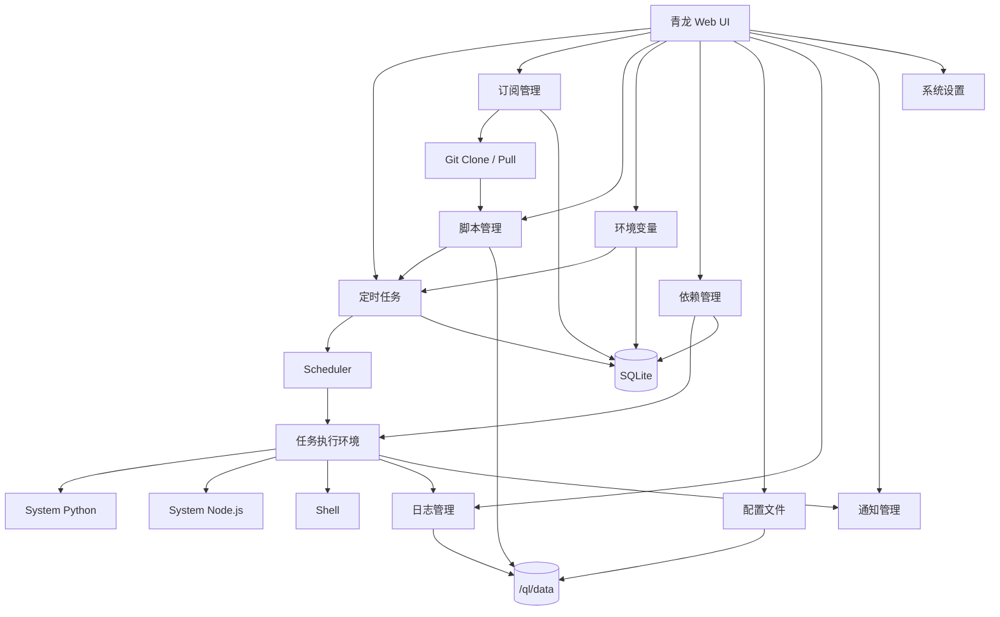
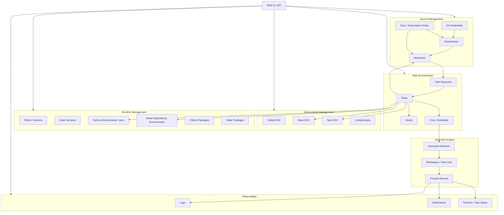
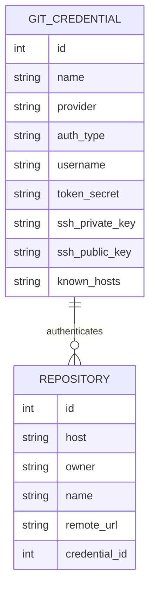
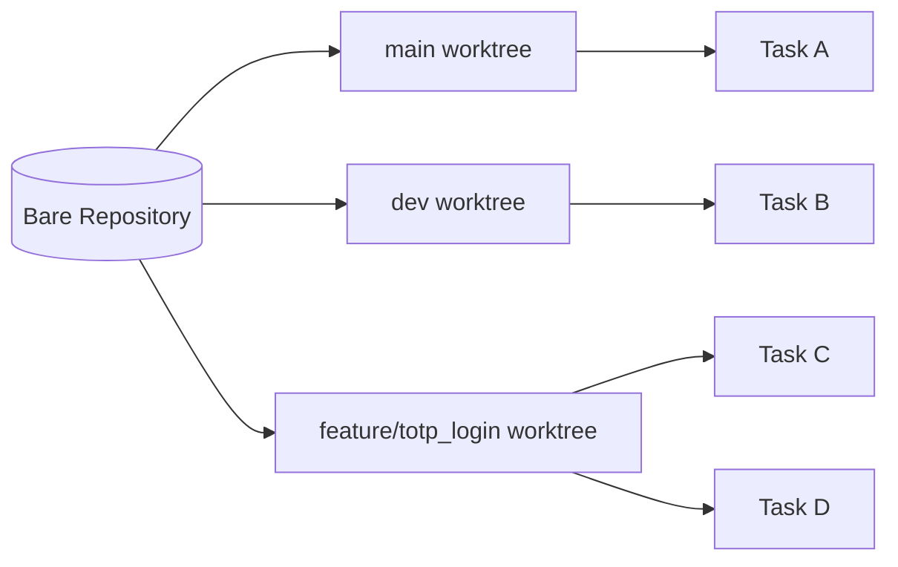
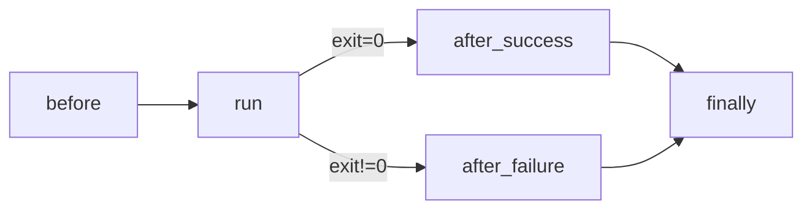
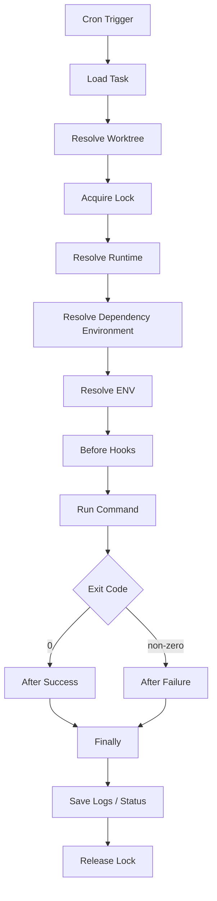
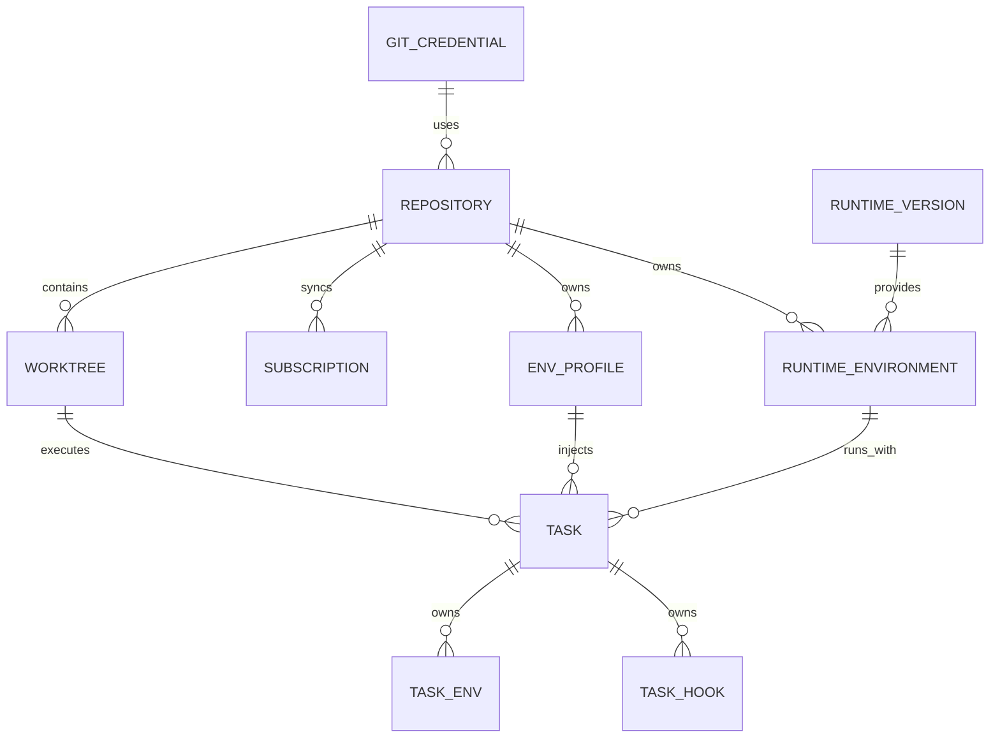
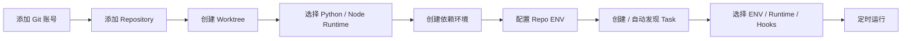

# 青龙面板 Runtime Workspace 重构产品架构

## 一、产品定位

现有青龙更接近：

```text
Git Subscription
      ↓
Script
      ↓
Cron Task
      ↓
System Python / Node
      ↓
Global ENV / Global Dependencies
      ↓
Logs
```

目标重构为：

```text
Git Repository
      ↓
Worktree
      ↓
Runtime Environment
      ↓
Dependency Environment
      ↓
Scoped ENV
      ↓
Task + Hooks
      ↓
Scheduler / Executor
      ↓
Logs / Notification
```

核心原则：

> Repository、Worktree、Runtime、Environment、Task 都是一等资源。

Task 不再自己隐式决定代码、Python、Node、ENV 和依赖，而是**引用这些资源后执行**。

---

# 二、现有青龙产品模块

目前产品层可以抽象为：



目前几个主要问题集中在：

```text
Repository
    └── 订阅只是“拉脚本来源”

Environment
    └── 基本是全局变量池

Runtime
    └── System Python / Node

Dependency
    └── 偏全局安装

Task
    └── 无法明确绑定：
        Repository
        Branch
        Worktree
        Python Version
        Venv
        Node Version
        Dependency Environment
        Env Scope
```

因此只要项目稍微复杂，例如：

```text
Python 3.12 + TensorFlow
Python 3.13 + Camoufox
Node 20
Node 24
不同 requirements.txt
不同 package.json
多个同名 PASSWORD / TOKEN
同仓库多个 branch
```

现有抽象就开始失效。

---

# 三、目标产品模块总架构



---

# 四、Git Credentials

新增：

```text
Git 凭据中心
```

独立于订阅和 Repository。

支持：

```text
GitHub
GitLab
Gitea
Generic Git

Authentication:
├── SSH Key
├── HTTPS Token / PAT
└── Anonymous
```

一个凭据可以被多个仓库复用：



UI：

```text
Git 凭据

GitHub Anysoft
├── 类型：SSH
├── Username：git
├── Key Fingerprint：SHA256:xxx
├── 状态：可用
└── [测试连接]

GitHub Bot
├── 类型：PAT
├── Username：bot
└── Token：ghp_********
```

Repository 创建时：

```text
Repository URL:
git@github.com:anysoft/extend-vps-exp.git

Credential:
[ GitHub Anysoft ▼ ]
```

不要将 Token 写进：

```text
https://token@github.com/...
```

执行 Git 时动态通过：

```text
GIT_SSH_COMMAND
GIT_ASKPASS
credential helper
```

注入凭据。

---

# 五、Git Repository + Worktree

这是本次最重要的改造之一。

## 5.1 Repository

Repository 只代表一个 Git Remote：

```text
github.com/anysoft/extend-vps-exp
```

底层建议使用 bare repository：

```text
/ql/data/git/
└── github.com/
    └── anysoft/
        └── extend-vps-exp.git
```

更新：

```bash
git fetch --all --prune
```

而不是：

```text
删除目录
重新 clone
```

Repository 页面提供：

```text
Repository

Remote
Credential
Default Branch
HEAD
Last Fetch
Remote Branches
Tags
Status

[Fetch]
[Prune]
[Create Worktree]
[View Commits]
```

---

## 5.2 Worktree

分支执行环境通过 `git worktree` 管理：

```text
/ql/data/worktrees/
└── github.com/
    └── anysoft/
        └── extend-vps-exp/
            ├── main/
            ├── dev/
            └── feature-totp_login/
```

逻辑：



好处：

```text
一个 Repository
        ↓
共享 Git Objects
        ↓
多个 Worktree

无需重复 clone

不同 branch 同时运行
互不 switch
互不覆盖
```

这比：

```bash
cd repo
git switch xxx
```

更适合并发任务。

---

# 六、Subscription 重构

不建议删除“订阅”概念。

但应该把它从：

> Git Repository 本身

改成：

> Repository Sync + Task Discovery Policy

即：

```text
Subscription
├── Repository
├── Worktree / Branch
├── Git Credential
├── Sync Cron
├── Include Pattern
├── Exclude Pattern
├── Task Discovery
└── Auto Update Policy
```

例如：

```text
Subscription: extend-vps-exp

Repository:
anysoft/extend-vps-exp

Credential:
GitHub Anysoft

Branch:
feature/totp_login

Sync:
0 */6 * * *

Task Discovery:
*.py
*.sh

Auto Create:
ON

Default Runtime:
Python 3.12.12

Default Python ENV:
extend-vps-exp/default
```

流程：


---

# 七、Environment Scope

现有 Global ENV 保留。

增加三层：

```text
Global ENV
    ↓
Repo ENV
    ↓
Task ENV
```

覆盖规则：

```text
Task ENV
   >
Repo ENV
   >
Global ENV
```

例如：

```text
GLOBAL:
HTTP_PROXY=...

REPOSITORY extend-vps-exp:
USERNAME=xxx
PASSWORD=xxx

TASK renew-vps:
HEADLESS=true
```

最终：

```text
HTTP_PROXY
USERNAME
PASSWORD
HEADLESS
```

只注入这个 Task 的子进程。

---

## ENV Profile

Repo ENV 建议进一步支持 Profile：

```text
extend-vps-exp

Profiles:
├── default
├── prod
├── test
└── account-2
```

Task 可以选择：

```text
Repo ENV:
extend-vps-exp / prod
```

这样同仓库：

```text
Task A → prod
Task B → test
```

无需复制项目。

---

# 八、Config Assets

很多项目不是 ENV 配置。

例如：

```text
.env
config.yaml
accounts.json
cookies.json
settings.toml
```

增加：

```text
Config Assets
```

例如：

```text
extend-vps-exp-prod.env
wps.yaml
telecom.json
```

保存到：

```text
/ql/data/config-assets/
```

不进入 Git Worktree。

Task Hook 可以：

```bash
ln -sf \
  /ql/data/config-assets/extend-vps-exp-prod.env \
  "$QL_WORKTREE/.env"
```

任务结束：

```bash
rm -f "$QL_WORKTREE/.env"
```

这样：

```text
Git 仓库
   +
配置资产
   +
Hook
```

完全解耦。

---

# 九、Hook 模型

现有执行前/执行后命令扩展为正式 Hook。

一个 Task：

```text
Before
Run
After Success
After Failure
Finally
```

执行链：



典型用途：

```text
before
├── ln config.yaml
├── ln .env
├── prepare temporary directory
└── prepare browser profile

run
└── python main.py

after_success
└── sync generated data

after_failure
└── send additional diagnostics

finally
├── remove symlink
└── cleanup temp files
```

---

# 十、Runtime Manager

Runtime 不再依赖青龙容器自身 Python / Node。

青龙系统 Runtime：

```text
System Runtime
```

只运行青龙自身。

业务 Runtime：

```text
Managed Runtime
```

完全独立。

---

# 十一、Python Runtime

使用：

```text
pyenv
```

统一保存：

```text
/ql/data/runtime/python/pyenv/
```

例如：

```text
Python Runtime

3.10.18
3.11.13
3.12.12
3.13.15
```

页面：

```text
Python Versions

Version     Status     Environments
3.11.13     Ready      3
3.12.12     Ready      8
3.13.15     Ready      2

[Install Python]
```

Task 永远不要直接：

```bash
python main.py
```

Resolver 最终生成：

```bash
/ql/data/runtime/python/venvs/.../bin/python main.py
```

---

# 十二、Python venv

Venv 本身作为独立资源。

关系不是：

```text
Task → 自动临时 venv
```

而是：

```text
Python Version
       ↓
Python Environment
       ↓
Task
```

例如：

```text
Python Environment

Name:
extend-vps-exp/default

Python:
3.12.12

Repository:
extend-vps-exp

Requirements:
requirements.txt

Packages:
aiohttp
camoufox
playwright
...
```

目录：

```text
/ql/data/runtime/python/venvs/
└── <repo-id>/
    ├── default/
    ├── legacy/
    └── captcha/
```

同一个 Repository 可以有：

```text
default
captcha
legacy
```

多个 venv。

Task 创建时：

```text
Runtime Type:
Python

Python Version:
3.12.12

Environment:
extend-vps-exp/default
```

自动创建的任务使用 Repository Default Environment。

---

# 十三、Python Dependency Management

建议分成三层。

## Level 1：下载缓存

所有 venv 共用：

```text
pip cache
```

路径：

```text
/ql/data/cache/pip/
```

这是默认优化方式。

不会损害依赖隔离。

---

## Level 2：Python Version Shared Packages

允许某个 Python Version 维护一套：

```text
Shared Packages
```

例如：

```text
Python 3.12

Shared:
requests
aiohttp
python-dotenv
pyyaml
```

创建 venv 时：

```text
[ ] Strict Isolation
[x] Inherit Shared Packages
```

相当于可选：

```bash
python -m venv --system-site-packages
```

但需要明确：

> Shared Packages 必须是显式可选功能，而不是默认行为。

否则：

```text
Repo A 升级 requests
```

可能影响 Repo B。

默认仍应该：

```text
Strict venv
+
Shared pip cache
```

---

## Level 3：Venv Packages

每个 venv 可视化维护：

```text
Package         Installed     Required
aiohttp         3.14.3        >=3.12
camoufox        x.x.x         pinned
tensorflow      2.18.1        ==2.18.1

[Install]
[Upgrade]
[Remove]
[Pip Check]
[Freeze]
[Sync requirements]
```

并展示：

```text
requirements.txt SHA256

Current:
abc...

Last Sync:
abc...

Status:
Synced
```

Git pull 后如果 requirements hash 改变：

```text
Dependencies changed
[Sync Now]
```

可选配置：

```text
Auto Sync Dependencies
```

---

# 十四、Node Runtime

Node 和 Python 同样处理。

建议内部 Runtime Adapter 首先支持：

```text
fnm
```

未来也可以支持：

```text
mise
nvm
```

目录：

```text
/ql/data/runtime/node/
```

版本：

```text
Node.js

18
20
22
24
```

Task：

```text
Runtime:
Node

Version:
22.20.x
```

---

# 十五、Node Dependency Environment

Node 不需要 Python venv 的概念。

隔离单位：

```text
Worktree + Node Version + node_modules
```

例如：

```text
worktree/
├── package.json
├── pnpm-lock.yaml
└── node_modules/
```

推荐默认：

```text
pnpm
```

因为：

```text
node_modules 独立
+
pnpm content-addressable store 共享
```

既达到：

```text
依赖隔离
```

又达到：

```text
磁盘去重
```

共享 store：

```text
/ql/data/cache/pnpm/
```

Dependency Environment：

```text
extend-vps-exp-node

Node:
22

Package Manager:
pnpm

Manifest:
package.json

Lock:
pnpm-lock.yaml
```

UI 同样提供：

```text
Packages
Install
Remove
Upgrade
Sync
Audit
```

---

# 十六、Runtime 抽象

后台不要把 Python / Node 写死在 Task 逻辑。

定义：

```text
RuntimeProvider
```

例如：

```text
RuntimeProvider
├── PythonProvider
│   └── pyenv
│
├── NodeProvider
│   └── fnm
│
└── SystemProvider
    ├── Shell
    └── legacy Python / Node
```

未来可以扩展：

```text
Java
Go
Ruby
Bun
Deno
```

而 Task Executor 不需要修改。

---

# 十七、Task 新模型

Task 最终应该包含：

```text
Task
├── Basic
│   ├── Name
│   ├── Cron
│   ├── Enabled
│   └── Timeout
│
├── Source
│   ├── Repository
│   ├── Worktree
│   └── Working Directory
│
├── Runtime
│   ├── Type
│   ├── Version
│   └── Environment
│
├── Environment
│   ├── Global
│   ├── Repo Profile
│   └── Task ENV
│
├── Command
│   └── python main.py
│
└── Hooks
    ├── Before
    ├── After Success
    ├── After Failure
    └── Finally
```

UI 创建 Task：

```text
名称
VPS Renew

Cron
30 9 * * *

────────────────────

Repository
extend-vps-exp

Worktree
feature/totp_login

Working directory
/

────────────────────

Runtime
Python

Version
3.12.12

Python Environment
extend-vps-exp/default

────────────────────

Repo ENV
prod

Task ENV
2 variables

────────────────────

Before Hook
ln -sf ...

Command
python main.py

Finally Hook
rm -f .env
```

---

# 十八、自动创建 Task

Repository 设置 Default：

```text
Default Runtime:
Python 3.12.12

Default Environment:
extend-vps-exp/default

Default ENV:
prod
```

扫描到：

```python
# cron: 30 9 * * *
# new Env("VPS Renew")
```

自动生成：

```text
Task
├── Repository = extend-vps-exp
├── Worktree = feature/totp_login
├── Runtime = Python
├── Version = 3.12.12
├── Venv = extend-vps-exp/default
├── Repo ENV = prod
└── Command = python main.py
```

这样自动任务和手工任务使用完全相同的数据模型。

不要存在：

```text
自动任务一套逻辑
手动任务另一套逻辑
```

---

# 十九、真正的任务执行 Resolver

Scheduler 不应该直接拼 Shell。

增加：

```text
Execution Resolver
```

执行时：



Executor 最终拿到一个明确的：

```text
ExecutionContext
```

类似：

```text
Task ID
Worktree Path
Working Directory
Runtime Executable
PATH
ENV
Command
Hooks
Timeout
Log Path
```

---

# 二十、任务环境必须只影响子进程

不要：

```bash
export PASSWORD=xxx
```

污染青龙后台进程。

Executor 构造：

```text
child_process.spawn(
    command,
    {
        cwd,
        env
    }
)
```

环境类似：

```text
process.env
      +
Global ENV
      +
Repo ENV
      +
Task ENV
```

形成新的：

```text
Execution ENV
```

Task 结束直接销毁。

---

# 二十一、核心数据模型

建议新增这些核心 Entity：



建议核心表：

```text
git_credentials
repositories
worktrees
subscriptions

env_profiles
env_variables

runtime_versions
runtime_environments
runtime_packages

tasks
task_env_bindings
task_env_variables
task_hooks
```

不用一开始把所有历史表推翻。

可以逐步增加表，并给旧 Task 做：

```text
Legacy/System Runtime
```

兼容。

---

# 二十二、文件目录

最终建议：

```text
/ql/data/

├── db/
│   └── database.sqlite

├── git/
│   └── github.com/
│       └── anysoft/
│           └── extend-vps-exp.git

├── worktrees/
│   └── github.com/
│       └── anysoft/
│           └── extend-vps-exp/
│               ├── main/
│               └── feature-totp_login/

├── runtime/
│   ├── python/
│   │   ├── pyenv/
│   │   ├── venvs/
│   │   └── shared/
│   │
│   └── node/
│       ├── versions/
│       └── environments/

├── cache/
│   ├── pip/
│   ├── pnpm/
│   └── npm/

├── config-assets/
│   ├── repo/
│   └── task/

└── log/
```

这样 Docker 只需要：

```text
/ql/data
```

一个 volume。

---

# 二十三、Web UI 信息架构

不建议一下子大改青龙所有菜单。

推荐：

```text
首页

定时任务

仓库
├── Repositories
├── Worktrees
├── Subscriptions
└── Git Credentials

环境变量
├── Global
├── Repository
└── Task

Runtime
├── Python
│   ├── Versions
│   ├── Environments
│   └── Packages
│
└── Node.js
    ├── Versions
    ├── Environments
    └── Packages

配置文件

依赖管理
    → 后续逐步合并进 Runtime

脚本管理

日志

通知设置

系统设置
```

---

# 二十四、Repository 详情页

这是以后最重要的页面之一。

```text
extend-vps-exp

Overview
Branches
Worktrees
Tasks
Environment
Runtime
Dependencies
Sync History
Git Log
```

Overview：

```text
Remote
github.com/anysoft/extend-vps-exp

Credential
GitHub Anysoft

Last Fetch
2 min ago

Default Branch
main

Default Runtime
Python 3.12.12

Default Environment
extend-vps-exp/default

Default ENV
prod
```

这样用户是围绕：

```text
项目
```

管理任务，而不是围绕：

```text
一堆 Cron
```

管理项目。

---

# 二十五、Runtime 页面

Python：

```text
Python 3.12.12
├── Shared Packages
│   ├── requests
│   ├── aiohttp
│   └── dotenv
│
└── Environments
    ├── extend-vps-exp/default
    ├── telecom/default
    └── wps/default
```

点 Venv：

```text
extend-vps-exp/default

Python             3.12.12
Repository         extend-vps-exp
Size               824 MB
Requirements       requirements.txt
State              Healthy

Packages            42

[Sync]
[Install Package]
[Pip Check]
[Freeze]
[Rebuild]
[Delete]
```

---

# 二十六、建议的兼容策略

必须保留：

```text
System Python
System Node
Global Environment
旧 Subscription
旧 Cron Task
旧 Dependency
```

新 Task 可以选择：

```text
Runtime Mode:

○ Legacy / System
● Managed
```

这样历史任务全部可以继续跑。

不用一次迁完。

---

# 二十七、重构优先级

### Phase 1：Git Workspace

实现：

```text
Git Credentials
Repository
Fetch
Worktree
Subscription → Repository
```

这是后续所有资源的基础。

---

### Phase 2：Scoped ENV + Hooks

实现：

```text
Global / Repo / Task ENV
ENV Profile
Before
After Success
After Failure
Finally
Config Assets
```

这一阶段完成以后，很多现有脚本已经会非常好用。

---

### Phase 3：Python Runtime

实现：

```text
pyenv
Python Versions
venv
requirements
pip dependency UI
Task Runtime Binding
```

---

### Phase 4：Node Runtime

实现：

```text
fnm
Node Versions
npm / pnpm / yarn
node_modules environment
pnpm shared store
```

---

### Phase 5：Execution Resolver

把历史：

```text
Cron → shell command
```

最终统一成：

```text
Cron
 ↓
Execution Resolver
 ↓
Worktree
 ↓
Runtime
 ↓
Dependencies
 ↓
ENV
 ↓
Hooks
 ↓
Process Runner
```

完成以后整个模型才真正闭环。

---

# 二十八、最终产品模型

重构以后青龙应该形成六个核心概念：

```text
Credential
    ↓
Repository
    ↓
Worktree
    ↓
Runtime Environment
    ↓
Task
    ↓
Execution
```

外围：

```text
ENV
Hooks
Config Assets
Dependencies
Logs
Notifications
```

最终用户看到的逻辑非常简单：



这套模型的关键点是：

> **代码属于 Repository，分支属于 Worktree，依赖属于 Runtime Environment，配置属于 Environment / Config Assets，执行规则属于 Task。**

不要再让：

```text
Subscription
Task
Dependency
Environment
```

各自偷偷维护一部分项目状态。

这样后续无论加入：

```text
Docker Runtime
Java Runtime
Browser Runtime
GPU Runtime
Remote Runner
```

都还有清晰的扩展空间。

